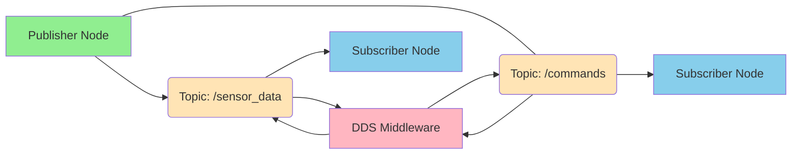
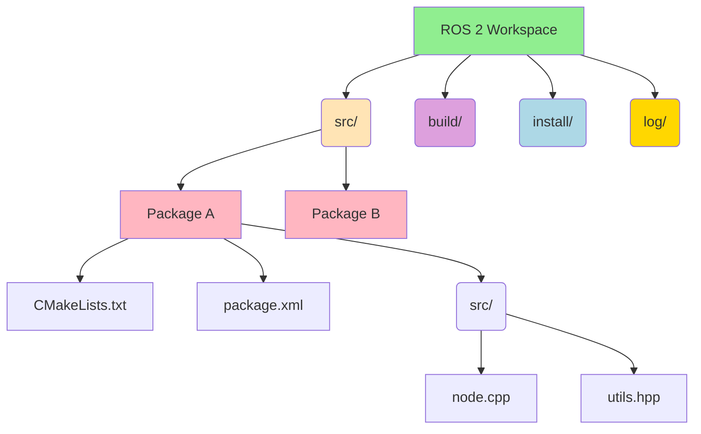

# Chapter 1: Introduction to ROS 2

## What is ROS 2?

Robot Operating System 2 (ROS 2) is a flexible framework for writing robot software. It's a collection of tools, libraries, and conventions that aim to simplify the task of creating complex and robust robot applications. ROS 2 is not an operating system in the traditional sense, but rather a meta-operating system that runs on top of an existing OS (like Linux, Windows, or macOS).

Key characteristics of ROS 2:

*   **Distributed**: ROS 2 systems are typically composed of many independent processes (nodes) that communicate with each other.
*   **Modular**: It promotes breaking down robot functionalities into smaller, reusable components.
*   **Real-time Capable**: Designed with modern real-time operating systems in mind, making it suitable for low-latency robotic control.
*   **Scalable**: Can be used for a wide range of robots, from small research platforms to large industrial systems.
*   **Secure**: Includes features for authentication, authorization, and encryption for secure robot communication.

## Why ROS 2 for Humanoid Robotics?

Humanoid robots are incredibly complex systems, requiring sophisticated control, perception, and decision-making capabilities. ROS 2 provides a robust foundation for developing these capabilities due to its:

*   **Extensive Tooling**: A rich ecosystem of tools for visualization (RViz), debugging, data logging, and more.
*   **Hardware Abstraction**: Allows developers to write code that is largely independent of the specific robot hardware.
*   **Community and Libraries**: A large, active community and a vast collection of open-source libraries for common robotic tasks (e.g., navigation, manipulation, computer vision).
*   **Interoperability**: Its distributed nature allows easy integration of various sensors, actuators, and high-level AI components.
*   **Future-Proofing**: Continuous development ensures it stays relevant with new advancements in robotics and AI.

## Core Concepts Overview

Before diving into details, it's helpful to understand some fundamental ROS 2 concepts:

*   **Nodes**: Executable processes that perform computation (e.g., a node to read sensor data, a node to control motors).
*   **Topics**: A publish/subscribe mechanism for nodes to exchange data (e.g., a sensor node publishes data to a `camer-images` topic, and a perception node subscribes to it).
*   **Services**: A request/response mechanism for nodes to offer and consume functionalities (e.g., a client node requests a `move_robot` service from a control node).
*   **Actions**: A long-running goal-oriented communication mechanism, suitable for tasks that take time to complete and require continuous feedback (e.g., a navigation action to move a robot to a specific location).
*   **Parameters**: Configuration values that can be set dynamically for nodes.
*   **ROS 2 Graph**: The network of all the ROS 2 elements (nodes, topics, services, actions) running concurrently.

In the following chapters, we will delve deeper into each of these concepts with practical examples and code snippets.

### Diagram: ROS 2 Distributed Data Service (DDS) Architecture

**Figure 1.1**: ROS 2 Distributed Data Service (DDS) architecture, illustrating asynchronous communication via topics and the DDS middleware.

### Diagram: ROS 2 Workspace Structure

**Figure 1.2**: Typical ROS 2 workspace structure, showing directories for source packages, build artifacts, installed packages, and logs.
