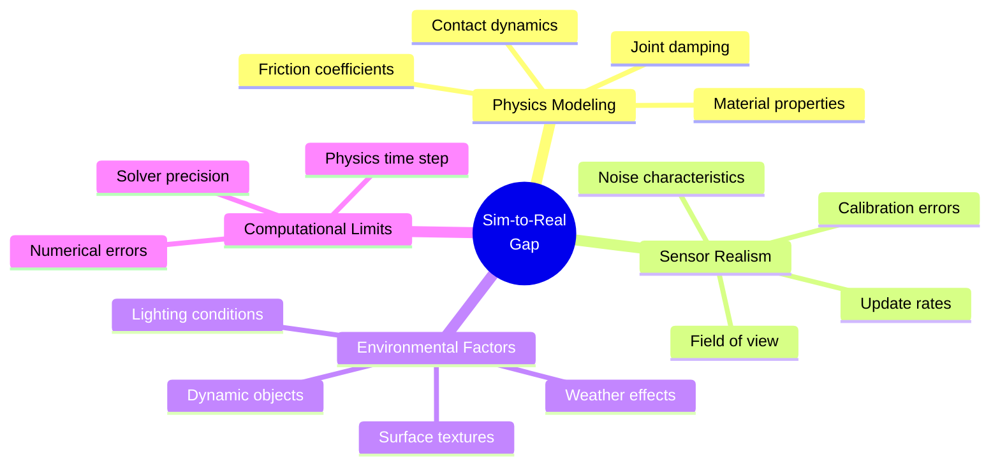
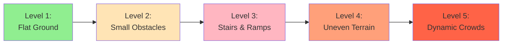
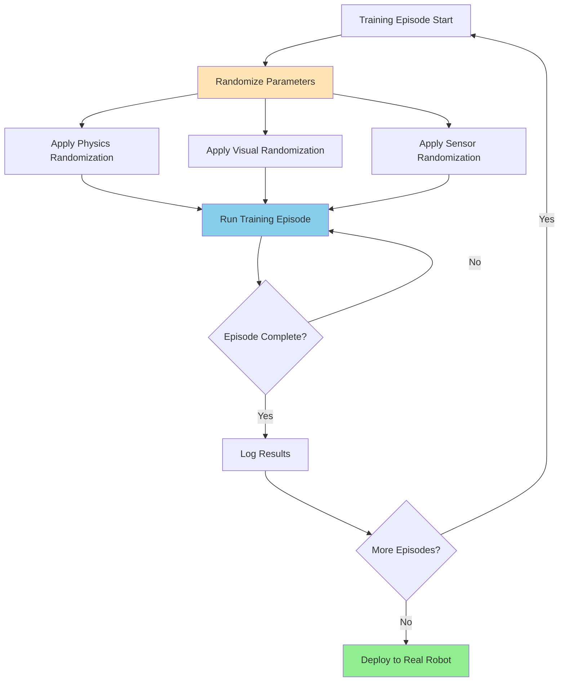
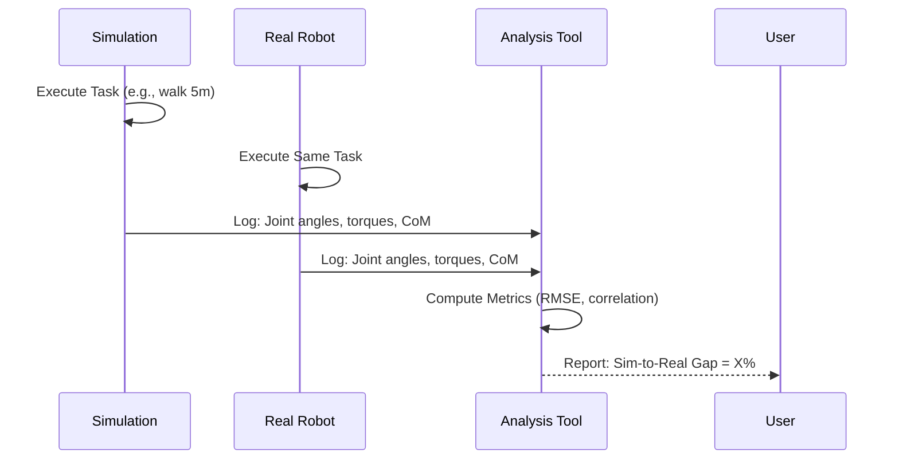

# Chapter 10: Building Realistic Simulation Environments

## 10.1 The Simulation-to-Reality Gap

The **sim-to-real gap** refers to the discrepancy between simulated robot behavior and real-world performance. Bridging this gap is critical for humanoid robotics, where:
*   **Dynamic stability** depends on precise physics modeling
*   **Perception systems** must handle real-world noise and variability
*   **Control algorithms** trained in simulation must transfer to hardware

### Sources of the Sim-to-Real Gap



**Figure 10.1**: Factors contributing to the sim-to-real gap in robotics simulation.

## 10.2 Physics Parameter Tuning for Realistic Humanoid Simulation

### Critical Physics Parameters

#### 1. Contact and Friction

```xml
<!-- Gazebo SDF: Realistic contact parameters -->
<collision name="foot_collision">
  <geometry>
    <box>
      <size>0.15 0.08 0.02</size>
    </box>
  </geometry>

  <surface>
    <friction>
      <ode>
        <mu>0.9</mu>      <!-- Coefficient of friction (rubber on concrete) -->
        <mu2>0.9</mu2>    <!-- Secondary friction direction -->
        <slip1>0.0</slip1>
        <slip2>0.0</slip2>
      </ode>
    </friction>

    <contact>
      <ode>
        <kp>1e7</kp>      <!-- Contact stiffness (N/m) -->
        <kd>1.0</kd>      <!-- Contact damping (N·s/m) -->
        <max_vel>0.01</max_vel>
        <min_depth>0.001</min_depth>
      </ode>
    </contact>
  </surface>
</collision>
```

**Tuning Guidelines**:
*   **mu (friction)**: 0.8-1.0 for rubber on hard surfaces, 0.3-0.5 for slippery surfaces
*   **kp (stiffness)**: Higher values (1e6-1e8) for rigid contacts, lower for soft materials
*   **kd (damping)**: Typically 0.1-10, prevents excessive bouncing

#### 2. Joint Dynamics

```xml
<joint name="knee_pitch_joint" type="revolute">
  <parent>thigh_link</parent>
  <child>shin_link</child>
  <axis>
    <xyz>0 1 0</xyz>
    <limit>
      <lower>-2.18</lower>  <!-- -125 degrees -->
      <upper>0.0</upper>    <!-- 0 degrees -->
      <effort>150.0</effort>  <!-- Max torque (Nm) -->
      <velocity>6.0</velocity>  <!-- Max angular velocity (rad/s) -->
    </limit>
    <dynamics>
      <damping>1.5</damping>    <!-- Joint damping (Nm·s/rad) -->
      <friction>0.2</friction>  <!-- Static friction (Nm) -->
      <spring_stiffness>0</spring_stiffness>
    </dynamics>
  </axis>
</joint>
```

**Real-World Matching**:
*   Measure actual motor torque limits from datasheets
*   Test joint friction by moving limbs manually
*   Validate velocity limits with hardware telemetry

#### 3. Inertial Properties

```xml
<link name="torso_link">
  <inertial>
    <mass>15.0</mass>  <!-- kg -->
    <pose>0 0 0.2 0 0 0</pose>  <!-- Center of mass offset -->
    <inertia>
      <ixx>0.3</ixx>
      <ixy>0.0</ixy>
      <ixz>0.0</ixz>
      <iyy>0.25</iyy>
      <iyz>0.0</iyz>
      <izz>0.15</izz>
    </inertia>
  </inertial>
</link>
```

**Calculating Inertia**:
```python
# For a box: I = (1/12) * m * (h² + d²)
def calculate_box_inertia(mass, width, height, depth):
    ixx = (1/12) * mass * (height**2 + depth**2)
    iyy = (1/12) * mass * (width**2 + depth**2)
    izz = (1/12) * mass * (width**2 + height**2)
    return ixx, iyy, izz

# Example: Torso (15kg, 0.3m x 0.5m x 0.2m)
ixx, iyy, izz = calculate_box_inertia(15, 0.3, 0.5, 0.2)
print(f"Ixx: {ixx:.3f}, Iyy: {iyy:.3f}, Izz: {izz:.3f}")
```

### Physics Engine Selection

| Engine | Strengths | Weaknesses | Best For |
|--------|-----------|------------|----------|
| **ODE** | Fast, stable | Less accurate contacts | Rapid prototyping |
| **Bullet** | Good performance | Moderate accuracy | General robotics |
| **DART** | High accuracy | Slower | Humanoid balance, manipulation |
| **MuJoCo** | Fast, accurate | Proprietary (now free) | RL training, optimization |

**For Humanoids**: DART or MuJoCo are recommended for accurate multi-contact simulation.

## 10.3 Environment Complexity and Variability

### Design Principles

1.  **Start Simple, Add Complexity**: Begin with empty worlds, gradually add obstacles
2.  **Domain Randomization**: Vary physics parameters to improve robustness
3.  **Scenario Diversity**: Train on multiple environments (indoor, outdoor, stairs, etc.)
4.  **Dynamic Elements**: Include moving objects, people, pets

### Example: Progressive Environment Difficulty



**Figure 10.2**: Incremental environment complexity for training robust humanoid behaviors.

### Procedural Environment Generation

```python
# Gazebo plugin for random obstacle placement
import random

def generate_random_obstacles(world_sdf, num_obstacles=20):
    obstacles = []
    for i in range(num_obstacles):
        x = random.uniform(-5, 5)
        y = random.uniform(-5, 5)
        size = random.uniform(0.1, 0.5)
        height = random.uniform(0.1, 2.0)

        obstacle = f"""
        <model name="obstacle_{i}">
          <pose>{x} {y} {height/2} 0 0 0</pose>
          <static>true</static>
          <link name="link">
            <collision name="collision">
              <geometry>
                <box><size>{size} {size} {height}</size></box>
              </geometry>
            </collision>
            <visual name="visual">
              <geometry>
                <box><size>{size} {size} {height}</size></box>
              </geometry>
            </visual>
          </link>
        </model>
        """
        obstacles.append(obstacle)

    return "".join(obstacles)
```

## 10.4 Domain Randomization for Sim-to-Real Transfer

### What is Domain Randomization?

**Domain randomization** systematically varies simulation parameters during training to force the model to learn robust, generalizable policies.

### Randomization Strategies

#### 1. Visual Randomization

```python
# Unity/Gazebo: Randomize textures, lighting, colors
class VisualRandomizer:
    def randomize_lighting(self):
        # Random light intensity
        intensity = random.uniform(0.5, 2.0)
        # Random light angle
        angle = random.uniform(0, 360)
        # Random ambient color
        ambient = (random.random(), random.random(), random.random())

    def randomize_textures(self):
        # Apply random materials to environment objects
        materials = ['wood', 'concrete', 'metal', 'carpet']
        for obj in scene_objects:
            obj.material = random.choice(materials)
```

#### 2. Physics Randomization

```python
class PhysicsRandomizer:
    def randomize_parameters(self):
        # Friction: ±20%
        friction = random.uniform(0.8, 1.2) * base_friction

        # Mass: ±10%
        mass = random.uniform(0.9, 1.1) * base_mass

        # Joint damping: ±30%
        damping = random.uniform(0.7, 1.3) * base_damping

        # Floor compliance
        floor_stiffness = random.uniform(1e6, 1e8)

        return {
            'friction': friction,
            'mass': mass,
            'damping': damping,
            'floor_stiffness': floor_stiffness
        }
```

#### 3. Sensor Randomization

```xml
<!-- Variable sensor noise -->
<sensor name="camera" type="camera">
  <camera>
    <noise>
      <type>gaussian</type>
      <mean>0.0</mean>
      <!-- Randomized between episodes -->
      <stddev>RANDOM(0.005, 0.02)</stddev>
    </noise>
  </camera>
</sensor>
```

### Randomization Workflow



**Figure 10.3**: Training loop with domain randomization for robust policy learning.

## 10.5 Best Practices for Stable Humanoid Simulation

### 1. Time Step and Solver Configuration

```xml
<physics name="humanoid_physics" type="ode">
  <max_step_size>0.001</max_step_size>  <!-- 1ms for stable contacts -->
  <real_time_factor>1.0</real_time_factor>
  <real_time_update_rate>1000</real_time_update_rate>  <!-- 1000 Hz -->

  <ode>
    <solver>
      <type>quick</type>  <!-- or 'world' for more accuracy -->
      <iters>50</iters>   <!-- Higher for better convergence -->
      <sor>1.3</sor>      <!-- Successive over-relaxation parameter -->
    </solver>

    <constraints>
      <cfm>0.0</cfm>      <!-- Constraint force mixing -->
      <erp>0.2</erp>      <!-- Error reduction parameter -->
      <contact_max_correcting_vel>100.0</contact_max_correcting_vel>
      <contact_surface_layer>0.001</contact_surface_layer>
    </constraints>
  </ode>
</physics>
```

**Key Parameters**:
*   **max_step_size**: Smaller = more stable (0.001-0.002s typical)
*   **iters**: Higher = more accurate (30-100)
*   **erp**: Error correction (0.1-0.8, lower = softer contacts)

### 2. Preventing Simulation Explosions

```python
# ROS 2 node to monitor simulation health
class SimulationMonitor(Node):
    def __init__(self):
        super().__init__('simulation_monitor')
        self.joint_sub = self.create_subscription(
            JointState, '/joint_states', self.check_joints, 10
        )

    def check_joints(self, msg):
        for i, velocity in enumerate(msg.velocity):
            # Detect unrealistic velocities
            if abs(velocity) > 50.0:  # rad/s
                self.get_logger().error(
                    f'Joint {msg.name[i]} unstable: {velocity} rad/s'
                )
                self.reset_simulation()

    def reset_simulation(self):
        # Call Gazebo reset service
        self.get_logger().warn('Resetting simulation due to instability')
        # Implementation: gz service call /world/reset
```

### 3. Foot-Ground Contact Tuning

Critical for humanoid balance:

```xml
<!-- Optimized foot contact -->
<collision name="foot_collision">
  <geometry>
    <box><size>0.15 0.08 0.02</size></box>
  </geometry>
  <surface>
    <friction>
      <ode>
        <mu>1.0</mu>
        <mu2>1.0</mu2>
        <fdir1>1 0 0</fdir1>  <!-- Primary friction direction -->
      </ode>
    </friction>
    <contact>
      <ode>
        <kp>1e7</kp>        <!-- Stiff contact -->
        <kd>10.0</kd>       <!-- High damping -->
        <max_vel>0.01</max_vel>
        <min_depth>0.0</min_depth>
      </ode>
    </contact>
  </surface>
</collision>
```

### 4. Center of Mass (CoM) Validation

```python
# Verify CoM is within support polygon
def check_stability(robot_state):
    com = robot_state.center_of_mass
    support_polygon = calculate_support_polygon(robot_state.foot_contacts)

    if not point_in_polygon(com[:2], support_polygon):
        logger.warning('CoM outside support polygon - robot may fall')
        return False
    return True
```

## 10.6 Benchmarking Simulation Realism

### Quantitative Metrics

1.  **Contact Force Error**: Compare simulated vs. real force/torque sensor data
2.  **Joint Trajectory Tracking**: Measure deviation from commanded positions
3.  **Energy Consumption**: Validate motor current/power usage
4.  **Gait Stability**: Compare ZMP (Zero Moment Point) trajectories

### Validation Workflow



**Figure 10.4**: Process for quantifying sim-to-real transfer accuracy.

### Example Comparison

```python
import numpy as np
from scipy.stats import pearsonr

def evaluate_sim_to_real(sim_data, real_data):
    # Joint angle RMSE
    joint_rmse = np.sqrt(np.mean((sim_data['joints'] - real_data['joints'])**2))

    # Torque correlation
    torque_corr, _ = pearsonr(sim_data['torques'].flatten(), real_data['torques'].flatten())

    # CoM trajectory error
    com_error = np.linalg.norm(sim_data['com'] - real_data['com'], axis=1).mean()

    print(f'Joint RMSE: {joint_rmse:.3f} rad')
    print(f'Torque Correlation: {torque_corr:.3f}')
    print(f'CoM Error: {com_error:.3f} m')

    # Acceptable if RMSE < 0.1 rad, correlation > 0.8, CoM error < 0.05m
    return joint_rmse < 0.1 and torque_corr > 0.8 and com_error < 0.05
```

## 10.7 Case Study: Humanoid Walking in Simulation

### Environment Setup

```xml
<world name="walking_test">
  <physics name="1ms" type="dart">  <!-- DART for accurate contacts -->
    <max_step_size>0.001</max_step_size>
    <real_time_factor>1.0</real_time_factor>
  </physics>

  <!-- Flat terrain -->
  <model name="ground">
    <static>true</static>
    <link name="link">
      <collision name="collision">
        <geometry>
          <plane><normal>0 0 1</normal></plane>
        </geometry>
        <surface>
          <friction>
            <ode><mu>0.9</mu><mu2>0.9</mu2></ode>
          </friction>
        </surface>
      </collision>
    </link>
  </model>

  <!-- Humanoid robot -->
  <include>
    <uri>model://my_humanoid</uri>
    <pose>0 0 1.0 0 0 0</pose>
  </include>
</world>
```

### Validation Checklist

- [ ] Robot stands without falling (static balance)
- [ ] CoM stays within support polygon during stance
- [ ] Foot contacts are stable (no jitter or penetration)
- [ ] Walking gait matches real robot's pattern
- [ ] Energy consumption is realistic (compare motor currents)
- [ ] Transition from sim to real requires &lt;5 parameter adjustments

## 10.8 Tools for Environment Creation

### 1. Blender for 3D Asset Creation

```python
# Export Blender models as COLLADA (.dae) for Gazebo
import bpy

# Example: Export selected objects
bpy.ops.wm.collada_export(
    filepath='/path/to/model.dae',
    apply_modifiers=True,
    triangulate=True
)
```

### 2. Gazebo Model Database

```bash
# Download pre-built models
gz fuel download -u https://fuel.gazebosim.org/1.0/OpenRobotics/models/Oak tree

# List available models
gz fuel list -t model
```

### 3. Procedural Terrain Generation

```python
# Generate heightmap terrain
from PIL import Image
import numpy as np

def generate_terrain_heightmap(width, height, roughness=0.5):
    # Perlin noise or diamond-square algorithm
    heightmap = np.random.rand(height, width) * roughness

    # Save as grayscale image
    img = Image.fromarray((heightmap * 255).astype(np.uint8))
    img.save('terrain_heightmap.png')

# Use in Gazebo SDF
"""
<geometry>
  <heightmap>
    <uri>file://terrain_heightmap.png</uri>
    <size>100 100 10</size>  <!-- X Y Z dimensions -->
  </heightmap>
</geometry>
"""
```

## 10.9 Cloud-Based Simulation for Scalability

### Benefits of Cloud Simulation

*   **Parallel Training**: Run thousands of simulation instances
*   **Resource Scaling**: Access high-performance GPUs on demand
*   **Collaboration**: Share environments and results across teams
*   **CI/CD Integration**: Automated testing in cloud pipelines

### Example: AWS RoboMaker

```python
# AWS RoboMaker simulation job (conceptual)
import boto3

robomaker = boto3.client('robomaker')

response = robomaker.create_simulation_job(
    maxJobDurationInSeconds=3600,
    iamRole='arn:aws:iam::account:role/RoboMakerRole',
    simulationApplications=[{
        'application': 'arn:aws:robomaker:region:account:simulation-application/my-app',
        'launchConfig': {
            'packageName': 'humanoid_sim',
            'launchFile': 'walking_test.launch.py'
        }
    }],
    compute={'simulationUnitLimit': 15}  # GPU instances
)
```

## 10.10 Future Directions: Photorealistic Simulation

### NVIDIA Omniverse and Isaac Sim

*   **USD (Universal Scene Description)**: Industry-standard 3D format
*   **RTX Ray Tracing**: Photorealistic lighting and shadows
*   **PhysX 5**: High-fidelity physics with GPU acceleration
*   **Domain Randomization**: Built-in support for visual and physics variation

**Next Module Preview**: We will explore Isaac Sim in detail in Module 3.

## Summary

Building realistic simulation environments requires:
1.  **Accurate physics modeling**: Tuned friction, inertia, and contact parameters
2.  **Environment diversity**: Progressive complexity and domain randomization
3.  **Systematic validation**: Quantitative metrics comparing sim vs. real performance
4.  **Robust simulation settings**: Appropriate time steps, solvers, and monitoring
5.  **Scalable infrastructure**: Cloud-based simulation for parallel training

By following these best practices, developers can minimize the sim-to-real gap and deploy humanoid robots with confidence that behaviors learned in simulation will transfer to the physical world.

The next module will introduce NVIDIA Isaac Sim and Isaac ROS, which provide cutting-edge tools for perception, navigation, and AI-driven robot intelligence.

## Further Reading

*   Tobin, J., et al. (2017). "Domain Randomization for Transferring Deep Neural Networks from Simulation to the Real World." *IEEE/RSJ IROS*.
*   Peng, X. B., et al. (2018). "Sim-to-Real Transfer of Robotic Control with Dynamics Randomization." *IEEE ICRA*.
*   [Gazebo Physics Engine Comparison](https://gazebosim.org/api/physics/6.0/physicsengine.html)
*   [MuJoCo Documentation](https://mujoco.readthedocs.io/)
*   OpenAI. (2019). "Solving Rubik's Cube with a Robot Hand." [Blog Post](https://openai.com/blog/solving-rubiks-cube/)
