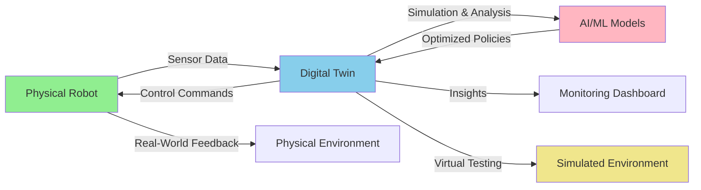
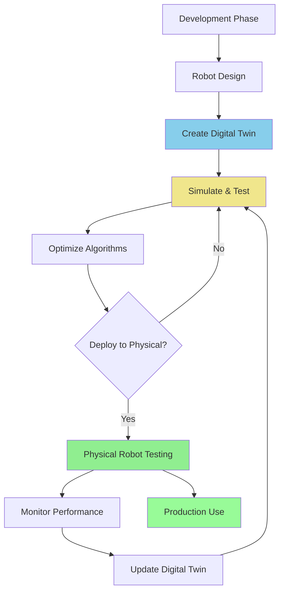

# Chapter 6: Introduction to Digital Twins

## 6.1 What are Digital Twins?

A **digital twin** is a virtual representation or model of a physical object, system, or process. It's not just a simulation; it's a dynamic, living model that is continuously updated with real-world data from its physical counterpart. This real-time data synchronization allows the digital twin to accurately mirror the state, behavior, and performance of the physical entity throughout its lifecycle.

Key characteristics of digital twins:

*   **Synchronization**: Continuously updated with data from the physical twin.
*   **High Fidelity**: Aims to be a highly accurate representation of the physical asset.
*   **Bidirectional Link**: Information flows from the physical to the digital, and insights from the digital can influence the physical.
*   **Lifecycle Coverage**: Supports the entire lifecycle, from design and development to operation and maintenance.
*   **Data-Driven**: Leverages sensor data, historical data, and analytical models.

## 6.2 Digital vs. Physical Robot: A Conceptual Comparison

**Figure 6.1**: Bidirectional relationship between physical robot and digital twin, showing data flow, simulation, and optimization loops.

### Key Differences: Physical vs. Digital Robots

| Aspect | Physical Robot | Digital Twin |
|--------|---------------|--------------|
| **Cost** | High (hardware, maintenance) | Low (computational resources only) |
| **Risk** | Damage, injury, failure costs | Zero physical risk |
| **Testing Speed** | Real-time only | Can be accelerated or slowed |
| **Iteration** | Slow (hardware changes) | Fast (software updates) |
| **Scalability** | Limited by physical units | Unlimited parallel instances |
| **Environment** | Fixed physical space | Customizable virtual worlds |
| **Sensor Noise** | Real-world variability | Configurable/controllable |
| **Failure Recovery** | Requires physical repair | Instant reset |

**Figure 6.2**: Development lifecycle showing how digital twins enable iterative development before physical deployment.

## 6.3 Digital Twins in Robotics, Especially Humanoids

In robotics, digital twins are incredibly powerful, providing a safe, cost-effective, and flexible environment for development, testing, and training. For complex systems like humanoid robots, digital twins offer unprecedented advantages:

*   **Safe Experimentation**: Test risky behaviors, new control algorithms, or explore failure scenarios without endangering the physical robot or its environment.
*   **Accelerated Development**: Develop and debug software modules (e.g., perception, motion planning, AI) in parallel with hardware development.
*   **Training and Optimization**: Train AI models (e.g., reinforcement learning agents) in simulation and transfer the learned policies to the physical robot (sim-to-real).
*   **Remote Operation and Monitoring**: Control and monitor physical robots remotely through their digital counterparts.
*   **Predictive Maintenance**: Analyze the digital twin's performance to predict potential failures in the physical robot.
*   **Customization and Personalization**: Rapidly prototype and test modifications or custom behaviors for individual robots.

For humanoids, specifically, digital twins enable:

*   **Complex Kinematics and Dynamics**: Accurately model and simulate the intricate joint movements and dynamic balance of a humanoid.
*   **Human-Robot Interaction (HRI)**: Develop and test HRI scenarios in a controlled virtual environment.
*   **Multi-Modal Perception**: Integrate and test various virtual sensors (cameras, LiDAR, microphones) that mimic their physical counterparts.

## 6.4 Components of a Robotic Digital Twin

A robotic digital twin typically comprises several integrated components:

1.  **Physical Model**: The geometric and physical description of the robot (e.g., URDF or similar format).
2.  **Environmental Model**: A virtual representation of the robot's operating environment (e.g., 3D models of rooms, objects).
3.  **Simulation Engine**: A software platform that simulates physics, sensor data, and robot dynamics (e.g., Gazebo, Unity).
4.  **Sensor Models**: Virtual sensors that mimic the behavior and outputs of real-world sensors.
5.  **Control Interfaces**: Mechanisms to send commands to the virtual robot and receive its state (often ROS 2).
6.  **Data Acquisition & Integration**: Systems to collect data from the physical robot and feed it to the digital twin.
7.  **Analytics & AI Modules**: Software for processing simulated and real-time data, often including machine learning algorithms for control, perception, or decision-making.

In this module, we will explore two leading simulation environments, Gazebo and Unity, and how they can be leveraged to build comprehensive digital twins for humanoid robotics.