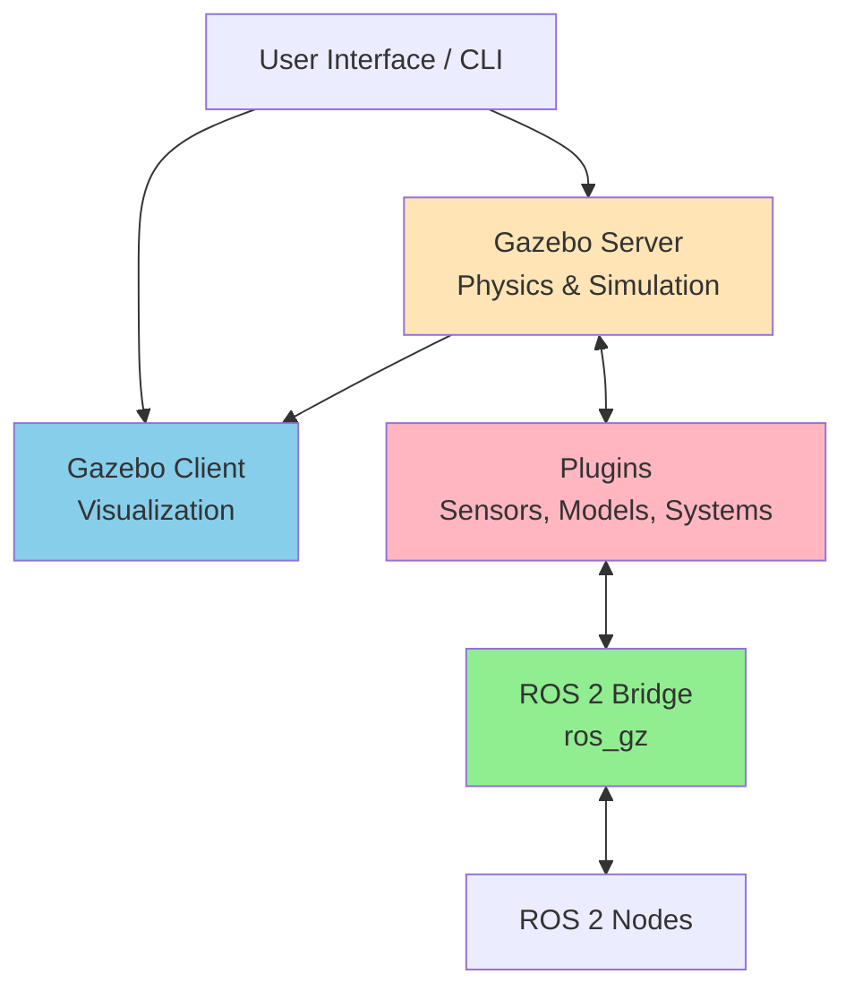
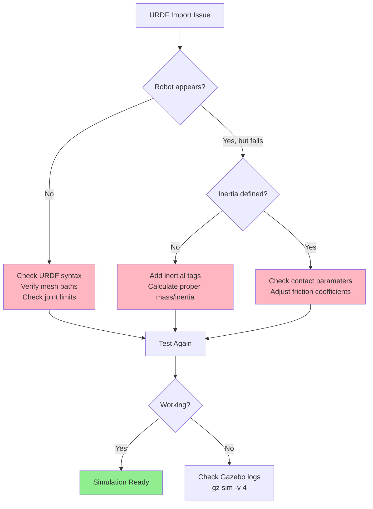

# Chapter 7: Gazebo Simulation Fundamentals

## 7.1 What is Gazebo?

**Gazebo** is a powerful, open-source 3D robotics simulator that provides robust physics simulation, high-quality graphics, and support for a wide variety of sensors and actuators. Originally developed by Open Source Robotics Foundation (OSRF), Gazebo has become the de facto standard for robotics simulation in the ROS ecosystem.

### Key Features of Gazebo

*   **Realistic Physics**: Uses physics engines (ODE, Bullet, Simbody, DART) to simulate dynamics, collisions, friction, and gravity.
*   **Sensor Simulation**: Supports cameras, depth sensors, LiDAR, IMU, contact sensors, and more.
*   **ROS Integration**: Seamless integration with ROS 2 via `ros_gz` bridge.
*   **URDF/SDF Support**: Directly loads robot models defined in URDF (Unified Robot Description Format) or SDF (Simulation Description Format).
*   **Plugin Architecture**: Extensible through custom plugins for sensors, actuators, and world behaviors.
*   **Headless Mode**: Can run without a GUI for automated testing and cloud-based simulation.
*   **Multi-Robot Simulation**: Supports multiple robots in the same environment.

### Gazebo Classic vs. Gazebo (Ignition)

| Feature | Gazebo Classic | Gazebo (Ignition/Fortress) |
|---------|---------------|---------------------------|
| **ROS Support** | ROS 1, limited ROS 2 | Optimized for ROS 2 |
| **Architecture** | Monolithic | Modular libraries |
| **Performance** | Good | Enhanced, better scalability |
| **Rendering** | OGRE | OGRE 2, modern graphics |
| **Development** | Maintenance mode | Active development |
| **Recommended For** | Legacy projects | New ROS 2 projects |

**Note**: This chapter focuses on modern Gazebo (Ignition Gazebo, now simply called "Gazebo"), which is the recommended platform for ROS 2 development.

## 7.2 Installing Gazebo for ROS 2

### Prerequisites

*   **Operating System**: Ubuntu 22.04 (Jammy) recommended for ROS 2 Humble
*   **ROS 2 Distribution**: Humble Hawksbill (LTS) or later
*   **Graphics**: GPU with OpenGL 3.3+ support

### Installation Steps

#### Option 1: Binary Installation (Recommended)

```bash
# Update package lists
sudo apt update

# Install Gazebo Fortress (recommended for ROS 2 Humble)
sudo apt install ros-humble-ros-gz

# Install Gazebo tools
sudo apt install gz-fortress

# Verify installation
gz sim --version
```

#### Option 2: Using Docker

```dockerfile
FROM osrf/ros:humble-desktop

# Install Gazebo
RUN apt-get update && apt-get install -y \
    ros-humble-ros-gz \
    gz-fortress \
    && rm -rf /var/lib/apt/lists/*

# Set up workspace
WORKDIR /ros2_ws
```

### Post-Installation Verification

```bash
# Test Gazebo launch
gz sim shapes.sdf

# Test ROS 2 integration
ros2 launch ros_gz_sim gz_sim.launch.py gz_args:=empty.sdf
```

## 7.3 Gazebo Architecture and Core Concepts



**Figure 7.1**: Gazebo architecture showing separation between simulation server and visualization client.

### Core Components

1.  **Gazebo Server (`gz sim -s`)**
    *   Runs physics calculations
    *   Manages world state
    *   Can run headless (no GUI)
    *   Communicates via Ignition Transport

2.  **Gazebo Client (`gz sim -g`)**
    *   Provides 3D visualization
    *   Renders sensor data
    *   Optional (useful for debugging)

3.  **World File (`.sdf`)**
    *   Defines the simulation environment
    *   Includes models, physics parameters, lighting
    *   XML-based format

4.  **Model Files (`.sdf` or URDF)**
    *   Describe robot structure
    *   Define links, joints, sensors, plugins

5.  **Plugins**
    *   Extend Gazebo functionality
    *   System plugins (world-level)
    *   Model plugins (robot-level)
    *   Sensor plugins (sensor-level)

## 7.4 Creating Your First Gazebo World

### Basic World File Structure

```xml
<?xml version="1.0" ?>
<sdf version="1.8">
  <world name="humanoid_training_world">

    <!-- Physics engine configuration -->
    <physics name="1ms" type="ignored">
      <max_step_size>0.001</max_step_size>
      <real_time_factor>1.0</real_time_factor>
    </physics>

    <!-- Lighting -->
    <light type="directional" name="sun">
      <pose>0 0 10 0 0 0</pose>
      <diffuse>1.0 1.0 1.0 1</diffuse>
      <specular>0.5 0.5 0.5 1</specular>
      <direction>-0.5 0.1 -0.9</direction>
    </light>

    <!-- Ground plane -->
    <model name="ground_plane">
      <static>true</static>
      <link name="link">
        <collision name="collision">
          <geometry>
            <plane>
              <normal>0 0 1</normal>
              <size>100 100</size>
            </plane>
          </geometry>
        </collision>
        <visual name="visual">
          <geometry>
            <plane>
              <normal>0 0 1</normal>
              <size>100 100</size>
            </plane>
          </geometry>
        </visual>
      </link>
    </model>

  </world>
</sdf>
```

### Launching the World

```bash
gz sim humanoid_training_world.sdf
```

## 7.5 Importing URDF Humanoid Models into Gazebo

### Understanding URDF to SDF Conversion

URDF (Unified Robot Description Format) models must be converted to SDF for native Gazebo use. Gazebo provides automatic conversion, but understanding the differences is crucial:

| Aspect | URDF | SDF |
|--------|------|-----|
| **Origin** | ROS-specific | Gazebo-native |
| **Flexibility** | Robot descriptions | Worlds, robots, environments |
| **Plugins** | Limited | Extensive |
| **Coordinate Frames** | ROS conventions | Gazebo conventions |
| **Physics Parameters** | Basic | Advanced |

### Loading a URDF Humanoid in Gazebo

#### Step 1: Prepare Your URDF Model

Ensure your URDF includes:
*   Complete kinematic chain (base to end-effectors)
*   Collision and visual geometries
*   Inertial properties for all links
*   Joint limits and dynamics

#### Step 2: Add Gazebo-Specific Tags

```xml
<!-- Example Gazebo tags in URDF -->
<gazebo reference="torso_link">
  <material>Gazebo/Blue</material>
  <mu1>0.8</mu1>  <!-- Friction coefficient -->
  <mu2>0.8</mu2>
</gazebo>

<!-- Gazebo plugin for ROS 2 control -->
<gazebo>
  <plugin filename="libgazebo_ros2_control.so" name="gazebo_ros2_control">
    <robot_namespace>/humanoid</robot_namespace>
    <parameters>config/controllers.yaml</parameters>
  </plugin>
</gazebo>
```

#### Step 3: Create a Launch File

```python
# launch/spawn_humanoid_gazebo.launch.py
from launch import LaunchDescription
from launch.actions import IncludeLaunchDescription, DeclareLaunchArgument
from launch.launch_description_sources import PythonLaunchDescriptionSource
from launch_ros.actions import Node
from ament_index_python.packages import get_package_share_directory
import os

def generate_launch_description():

    # Path to URDF file
    urdf_file = os.path.join(
        get_package_share_directory('humanoid_description'),
        'urdf',
        'humanoid.urdf'
    )

    # Read URDF content
    with open(urdf_file, 'r') as f:
        robot_description = f.read()

    # Spawn robot in Gazebo
    spawn_entity = Node(
        package='ros_gz_sim',
        executable='create',
        arguments=[
            '-name', 'my_humanoid',
            '-topic', '/robot_description',
            '-x', '0.0',
            '-y', '0.0',
            '-z', '1.0'
        ],
        output='screen'
    )

    # Publish robot description
    robot_state_publisher = Node(
        package='robot_state_publisher',
        executable='robot_state_publisher',
        parameters=[{'robot_description': robot_description}]
    )

    # Launch Gazebo
    gazebo = IncludeLaunchDescription(
        PythonLaunchDescriptionSource([
            os.path.join(get_package_share_directory('ros_gz_sim'), 'launch'),
            '/gz_sim.launch.py'
        ]),
        launch_arguments={'gz_args': 'empty.sdf'}.items()
    )

    return LaunchDescription([
        gazebo,
        robot_state_publisher,
        spawn_entity
    ])
```

#### Step 4: Launch the Simulation

```bash
# Source your workspace
source ~/ros2_ws/install/setup.bash

# Launch the simulation
ros2 launch humanoid_description spawn_humanoid_gazebo.launch.py
```

### Common Issues and Solutions



**Figure 7.2**: Troubleshooting workflow for URDF import issues.

## 7.6 Basic Gazebo Operations

### Camera Controls
*   **Rotate**: Click and drag with left mouse button
*   **Pan**: Click and drag with middle mouse button or Shift + left mouse
*   **Zoom**: Scroll wheel
*   **Focus**: Double-click on a model

### Model Manipulation
*   **Translate Mode**: Press 'T' → drag model
*   **Rotate Mode**: Press 'R' → rotate model
*   **Scale Mode**: Press 'S' → resize (static models only)

### Simulation Controls
```bash
# Play/Pause simulation
gz service -s /world/world_name/control --reqtype gz.msgs.WorldControl

# Reset simulation
gz service -s /world/world_name/control --reqtype gz.msgs.WorldControl --reptype gz.msgs.Boolean --req 'reset: {all: true}'

# Set simulation speed (real_time_factor)
gz service -s /world/world_name/control --reqtype gz.msgs.WorldControl --req 'real_time_factor: 0.5'
```

### Inspecting Running Simulation

```bash
# List all topics
gz topic -l

# Echo a specific topic
gz topic -e -t /world/world_name/stats

# List all services
gz service -l

# Get model info
gz model -m model_name -i
```

## 7.7 Gazebo and ROS 2 Integration (`ros_gz`)

### ROS 2 to Gazebo Message Bridging

```bash
# Install ros_gz bridge
sudo apt install ros-humble-ros-gz-bridge

# Bridge a specific topic (Gazebo → ROS 2)
ros2 run ros_gz_bridge parameter_bridge /scan@sensor_msgs/msg/LaserScan@gz.msgs.LaserScan

# Bridge multiple topics via config file
ros2 run ros_gz_bridge parameter_bridge --ros-args -p config_file:=bridge_config.yaml
```

**Example bridge configuration (`bridge_config.yaml`):**

```yaml
# Sensor data: Gazebo → ROS 2
- topic_name: "/camera/image_raw"
  ros_type_name: "sensor_msgs/msg/Image"
  gz_type_name: "gz.msgs.Image"
  direction: GZ_TO_ROS

# Control commands: ROS 2 → Gazebo
- topic_name: "/cmd_vel"
  ros_type_name: "geometry_msgs/msg/Twist"
  gz_type_name: "gz.msgs.Twist"
  direction: ROS_TO_GZ

# Bidirectional joint states
- topic_name: "/joint_states"
  ros_type_name: "sensor_msgs/msg/JointState"
  gz_type_name: "gz.msgs.Model"
  direction: BIDIRECTIONAL
```

### Benefits of Gazebo for Humanoid Development

1.  **Rapid Prototyping**: Test control algorithms without hardware
2.  **Safe Exploration**: Attempt risky maneuvers (jumping, falling) without damage
3.  **Parallel Development**: Hardware and software teams work independently
4.  **Automated Testing**: Run regression tests in CI/CD pipelines
5.  **Training Data Generation**: Collect synthetic sensor data for ML models
6.  **Multi-Environment Testing**: Quickly switch between different scenarios

## Summary

Gazebo provides a comprehensive simulation platform for humanoid robotics development. By integrating seamlessly with ROS 2, it enables developers to:

*   Build and test robot models before physical assembly
*   Develop perception and control algorithms in a safe, repeatable environment
*   Generate training data for AI-driven behaviors
*   Validate system integration across complex multi-robot scenarios

In the next chapter, we will explore how to simulate realistic sensors (LiDAR, cameras, IMU) in Gazebo to create a complete digital twin of a humanoid robot's perception system.

## Further Reading

*   [Gazebo Official Documentation](https://gazebosim.org/docs)
*   [ROS 2 + Gazebo Integration Guide](https://github.com/gazebosim/ros_gz)
*   [SDF Format Specification](http://sdformat.org/)
*   [Koenig, N., & Howard, A. (2004). "Design and use paradigms for Gazebo, an open-source multi-robot simulator." *IEEE/RSJ International Conference on Intelligent Robots and Systems*](https://ieeexplore.ieee.org/document/1389727).
