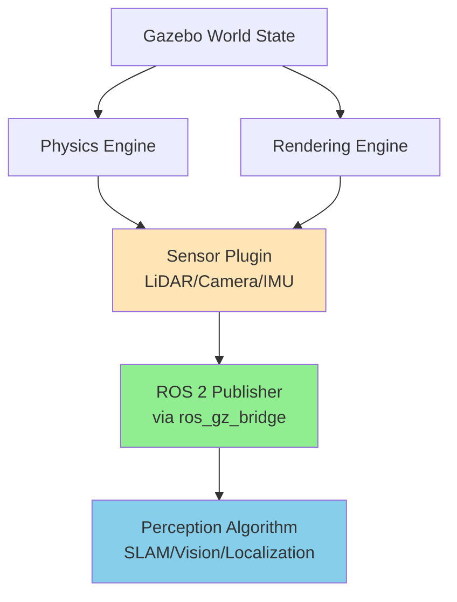
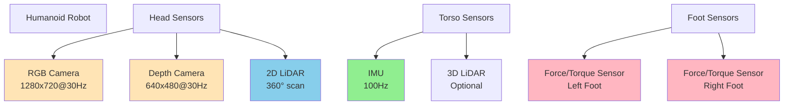

# Chapter 8: Simulated Sensors in Gazebo

## 8.1 Why Simulate Sensors?

Sensor simulation is critical for developing and testing perception algorithms in humanoid robotics. Real-world sensor data can be:
*   **Expensive**: High-quality LiDAR, depth cameras, and IMU sensors are costly
*   **Inconsistent**: Environmental conditions (lighting, weather) affect sensor performance
*   **Dangerous**: Testing failure scenarios with real sensors may damage hardware
*   **Limited**: Physical testing is constrained by available environments and scenarios

Gazebo's sensor simulation provides:
*   **Repeatability**: Identical conditions for regression testing
*   **Safety**: Test edge cases without risk
*   **Scalability**: Generate large datasets for machine learning
*   **Speed**: Parallel simulation for rapid iteration
*   **Accessibility**: Develop perception systems before hardware arrives

## 8.2 Sensor Simulation Architecture in Gazebo



**Figure 8.1**: Sensor data flow from Gazebo simulation to ROS 2 perception algorithms.

### Key Principles

1.  **Noise Models**: Gazebo adds realistic noise to sensor outputs (Gaussian, uniform, salt-and-pepper)
2.  **Update Rates**: Configurable Hz matching real sensors (e.g., 30 Hz camera, 10 Hz LiDAR)
3.  **Ray Casting**: For range sensors (LiDAR, sonar), Gazebo performs ray-casting against collision geometries
4.  **GPU Acceleration**: Camera and depth sensors leverage GPU rendering for performance

## 8.3 LiDAR Simulation

### What is LiDAR?

**LiDAR** (Light Detection and Ranging) measures distances by emitting laser pulses and measuring their time-of-flight. Common applications:
*   Obstacle detection and avoidance
*   3D mapping (SLAM)
*   Terrain analysis
*   Object recognition

### LiDAR Configuration in SDF

```xml
<!-- 2D LiDAR Sensor (e.g., Hokuyo, RPLidar) -->
<sensor name="lidar_2d" type="gpu_lidar">
  <pose>0 0 0.3 0 0 0</pose>
  <update_rate>10</update_rate>
  <topic>/scan</topic>

  <lidar>
    <scan>
      <horizontal>
        <samples>360</samples>        <!-- 360 laser beams -->
        <resolution>1.0</resolution>  <!-- Angular resolution -->
        <min_angle>-3.14159</min_angle>
        <max_angle>3.14159</max_angle>
      </horizontal>
    </scan>

    <range>
      <min>0.12</min>   <!-- Minimum range (meters) -->
      <max>10.0</max>   <!-- Maximum range (meters) -->
      <resolution>0.01</resolution>
    </range>

    <!-- Noise model -->
    <noise>
      <type>gaussian</type>
      <mean>0.0</mean>
      <stddev>0.01</stddev>  <!-- 1cm standard deviation -->
    </noise>
  </lidar>

  <!-- Visualization in Gazebo -->
  <visualize>true</visualize>
</sensor>
```

### 3D LiDAR (e.g., Velodyne, Ouster)

```xml
<sensor name="lidar_3d" type="gpu_lidar">
  <pose>0 0 0.5 0 0 0</pose>
  <update_rate>10</update_rate>
  <topic>/points</topic>

  <lidar>
    <scan>
      <horizontal>
        <samples>1024</samples>
        <resolution>1.0</resolution>
        <min_angle>-3.14159</min_angle>
        <max_angle>3.14159</max_angle>
      </horizontal>
      <vertical>
        <samples>64</samples>  <!-- 64 vertical channels -->
        <resolution>1.0</resolution>
        <min_angle>-0.2618</min_angle>  <!-- -15 degrees -->
        <max_angle>0.2618</max_angle>   <!-- +15 degrees -->
      </vertical>
    </scan>

    <range>
      <min>0.5</min>
      <max>100.0</max>
      <resolution>0.01</resolution>
    </range>
  </lidar>
</sensor>
```

### Accessing LiDAR Data in ROS 2

```python
import rclpy
from rclpy.node import Node
from sensor_msgs.msg import LaserScan, PointCloud2

class LidarProcessor(Node):
    def __init__(self):
        super().__init__('lidar_processor')

        # 2D LiDAR subscription
        self.scan_sub = self.create_subscription(
            LaserScan,
            '/scan',
            self.scan_callback,
            10
        )

        # 3D LiDAR subscription
        self.points_sub = self.create_subscription(
            PointCloud2,
            '/points',
            self.points_callback,
            10
        )

    def scan_callback(self, msg):
        # Process 2D laser scan
        ranges = msg.ranges  # List of distances
        angle_min = msg.angle_min
        angle_increment = msg.angle_increment

        # Example: Find closest obstacle
        min_distance = min([r for r in ranges if r > msg.range_min])
        min_index = ranges.index(min_distance)
        min_angle = angle_min + (min_index * angle_increment)

        self.get_logger().info(f'Closest obstacle: {min_distance:.2f}m at {min_angle:.2f} rad')

    def points_callback(self, msg):
        # Process 3D point cloud
        # Use libraries like open3d or sensor_msgs_py for parsing
        self.get_logger().info(f'Received point cloud with {msg.width * msg.height} points')
```

## 8.4 Camera Simulation

### RGB Camera Configuration

```xml
<sensor name="camera_rgb" type="camera">
  <pose>0 0 0.4 0 0 0</pose>
  <update_rate>30</update_rate>
  <topic>/camera/image_raw</topic>

  <camera>
    <horizontal_fov>1.396</horizontal_fov>  <!-- 80 degrees -->
    <image>
      <width>1280</width>
      <height>720</height>
      <format>R8G8B8</format>  <!-- RGB format -->
    </image>

    <clip>
      <near>0.1</near>
      <far>100.0</far>
    </clip>

    <!-- Lens distortion (optional, realistic) -->
    <distortion>
      <k1>-0.25</k1>
      <k2>0.12</k2>
      <k3>0.0</k3>
      <p1>-0.00028</p1>
      <p2>-0.00005</p2>
      <center>0.5 0.5</center>
    </distortion>

    <!-- Image noise -->
    <noise>
      <type>gaussian</type>
      <mean>0.0</mean>
      <stddev>0.007</stddev>
    </noise>
  </camera>

  <visualize>true</visualize>
</sensor>
```

### Depth Camera (e.g., Intel RealSense, Kinect)

```xml
<sensor name="depth_camera" type="depth_camera">
  <pose>0 0 0.4 0 0 0</pose>
  <update_rate>30</update_rate>

  <!-- RGB image topic -->
  <topic>/camera/color/image_raw</topic>

  <camera>
    <horizontal_fov>1.396</horizontal_fov>
    <image>
      <width>640</width>
      <height>480</height>
      <format>R8G8B8</format>
    </image>
    <clip>
      <near>0.3</near>
      <far>10.0</far>
    </clip>
  </camera>

  <!-- Depth-specific configuration -->
  <plugin filename="libgazebo_ros_camera.so" name="depth_camera_controller">
    <ros>
      <namespace>/camera</namespace>
      <remapping>depth_camera/image_raw:=depth/image_raw</remapping>
      <remapping>depth_camera/camera_info:=depth/camera_info</remapping>
      <remapping>depth_camera/points:=depth/points</remapping>
    </ros>

    <min_depth>0.3</min_depth>
    <max_depth>10.0</max_depth>
  </plugin>
</sensor>
```

### Processing Camera Data in ROS 2

```python
import rclpy
from rclpy.node import Node
from sensor_msgs.msg import Image, CameraInfo
from cv_bridge import CvBridge
import cv2

class CameraProcessor(Node):
    def __init__(self):
        super().__init__('camera_processor')
        self.bridge = CvBridge()

        # RGB image subscription
        self.rgb_sub = self.create_subscription(
            Image,
            '/camera/image_raw',
            self.rgb_callback,
            10
        )

        # Depth image subscription
        self.depth_sub = self.create_subscription(
            Image,
            '/camera/depth/image_raw',
            self.depth_callback,
            10
        )

    def rgb_callback(self, msg):
        # Convert ROS Image to OpenCV format
        cv_image = self.bridge.imgmsg_to_cv2(msg, desired_encoding='bgr8')

        # Example: Object detection preprocessing
        gray = cv2.cvtColor(cv_image, cv2.COLOR_BGR2GRAY)
        edges = cv2.Canny(gray, 50, 150)

        # Display (for debugging)
        cv2.imshow('Camera Feed', cv_image)
        cv2.imshow('Edge Detection', edges)
        cv2.waitKey(1)

    def depth_callback(self, msg):
        # Convert depth image
        depth_image = self.bridge.imgmsg_to_cv2(msg, desired_encoding='32FC1')

        # Example: Find nearest object
        min_depth = depth_image[depth_image > 0].min()
        self.get_logger().info(f'Nearest object: {min_depth:.2f} meters')
```

## 8.5 IMU (Inertial Measurement Unit) Simulation

### What Does an IMU Measure?

An IMU provides:
*   **Linear Acceleration** (3-axis): Movement in x, y, z
*   **Angular Velocity** (3-axis): Rotation rates (roll, pitch, yaw)
*   **Orientation** (quaternion or Euler angles): Current pose

Critical for:
*   Balance control in humanoids
*   State estimation
*   Sensor fusion (with cameras, LiDAR)
*   Dead reckoning

### IMU Configuration in SDF

```xml
<sensor name="imu_sensor" type="imu">
  <pose>0 0 0.2 0 0 0</pose>  <!-- Typically in torso/base link -->
  <update_rate>100</update_rate>  <!-- High-frequency for control -->
  <topic>/imu/data</topic>

  <imu>
    <!-- Linear acceleration -->
    <linear_acceleration>
      <x>
        <noise type="gaussian">
          <mean>0.0</mean>
          <stddev>0.017</stddev>  <!-- m/s² -->
          <bias_mean>0.1</bias_mean>
          <bias_stddev>0.001</bias_stddev>
        </noise>
      </x>
      <y>
        <noise type="gaussian">
          <mean>0.0</mean>
          <stddev>0.017</stddev>
        </noise>
      </y>
      <z>
        <noise type="gaussian">
          <mean>0.0</mean>
          <stddev>0.017</stddev>
        </noise>
      </z>
    </linear_acceleration>

    <!-- Angular velocity -->
    <angular_velocity>
      <x>
        <noise type="gaussian">
          <mean>0.0</mean>
          <stddev>0.0002</stddev>  <!-- rad/s -->
        </noise>
      </x>
      <y>
        <noise type="gaussian">
          <mean>0.0</mean>
          <stddev>0.0002</stddev>
        </noise>
      </y>
      <z>
        <noise type="gaussian">
          <mean>0.0</mean>
          <stddev>0.0002</stddev>
        </noise>
      </z>
    </angular_velocity>
  </imu>
</sensor>
```

### Processing IMU Data in ROS 2

```python
import rclpy
from rclpy.node import Node
from sensor_msgs.msg import Imu
import numpy as np

class ImuProcessor(Node):
    def __init__(self):
        super().__init__('imu_processor')

        self.imu_sub = self.create_subscription(
            Imu,
            '/imu/data',
            self.imu_callback,
            10
        )

        self.orientation_history = []

    def imu_callback(self, msg):
        # Extract orientation (quaternion)
        orientation = msg.orientation
        quat = [orientation.x, orientation.y, orientation.z, orientation.w]

        # Extract angular velocity
        angular_vel = msg.angular_velocity
        gyro = np.array([angular_vel.x, angular_vel.y, angular_vel.z])

        # Extract linear acceleration
        linear_acc = msg.linear_acceleration
        accel = np.array([linear_acc.x, linear_acc.y, linear_acc.z])

        # Example: Detect if robot is falling
        # (Large angular velocity or non-vertical orientation)
        gyro_magnitude = np.linalg.norm(gyro)
        if gyro_magnitude > 2.0:  # rad/s threshold
            self.get_logger().warn('High angular velocity detected! Robot may be falling.')

        # Example: Estimate tilt angle from gravity
        gravity_norm = np.linalg.norm(accel)
        tilt = np.arccos(accel[2] / gravity_norm)  # Angle from vertical
        self.get_logger().info(f'Tilt angle: {np.degrees(tilt):.2f} degrees')
```

## 8.6 Multi-Sensor Fusion: Creating a Complete Perception System

### Typical Humanoid Sensor Suite



**Figure 8.2**: Typical sensor placement on a humanoid robot for comprehensive environmental awareness.

### Sensor Fusion Example: SLAM with IMU and LiDAR

```python
# Conceptual sensor fusion node
class SensorFusionNode(Node):
    def __init__(self):
        super().__init__('sensor_fusion')

        # Subscribe to multiple sensors
        self.imu_sub = self.create_subscription(Imu, '/imu/data', self.imu_callback, 10)
        self.scan_sub = self.create_subscription(LaserScan, '/scan', self.scan_callback, 10)
        self.odom_sub = self.create_subscription(Odometry, '/odom', self.odom_callback, 10)

        # State estimation (simplified Extended Kalman Filter concept)
        self.state = {
            'position': [0.0, 0.0, 0.0],
            'velocity': [0.0, 0.0, 0.0],
            'orientation': [0.0, 0.0, 0.0, 1.0]  # quaternion
        }

    def imu_callback(self, msg):
        # Update orientation from IMU
        self.state['orientation'] = [
            msg.orientation.x,
            msg.orientation.y,
            msg.orientation.z,
            msg.orientation.w
        ]

    def scan_callback(self, msg):
        # Use LiDAR for localization (e.g., match scan to map)
        # Update position estimate
        pass

    def odom_callback(self, msg):
        # Integrate wheel odometry (if available)
        self.state['position'] = [
            msg.pose.pose.position.x,
            msg.pose.pose.position.y,
            msg.pose.pose.position.z
        ]
```

## 8.7 Advanced Sensor Simulation Techniques

### 1. Domain Randomization for Sim-to-Real Transfer

Vary sensor parameters to improve real-world robustness:

```python
# Randomize camera parameters in launch file
import random

def generate_camera_config():
    return {
        'noise_stddev': random.uniform(0.005, 0.015),
        'distortion_k1': random.uniform(-0.3, -0.2),
        'horizontal_fov': random.uniform(1.3, 1.5),  # 74-86 degrees
        'update_rate': random.choice([15, 30, 60])
    }
```

### 2. Synthetic Data Generation for ML Training

```bash
# Generate 10,000 labeled images for object detection
gz sim -s training_world.sdf &
ros2 run data_collector image_saver --output-dir ./dataset --count 10000
```

### 3. Sensor Failure Simulation

```xml
<!-- Intermittent sensor failure plugin -->
<plugin filename="libsensor_failure_plugin.so" name="failure_simulator">
  <failure_probability>0.01</failure_probability>  <!-- 1% chance per update -->
  <failure_duration>2.0</failure_duration>  <!-- 2 seconds -->
</plugin>
```

## 8.8 Performance Optimization for Sensor Simulation

### Best Practices

1.  **Use GPU sensors** (`gpu_lidar`, `gpu_ray`) when available
2.  **Reduce update rates** for non-critical sensors (e.g., 5 Hz for static environment cameras)
3.  **Limit sensor range** to minimum required (reduces ray-casting)
4.  **Use headless mode** (`gz sim -s`) for automated testing
5.  **Profile simulation** with `gz sim -v 4` to identify bottlenecks

### Comparison: Sensor Computational Costs

| Sensor Type | Relative Cost | Optimization Tips |
|-------------|--------------|-------------------|
| 2D LiDAR | Low | Use `gpu_lidar`, limit range |
| RGB Camera | Medium | Reduce resolution, lower update rate |
| Depth Camera | Medium-High | Use GPU, limit far clip plane |
| 3D LiDAR | High | Reduce samples, use GPU |
| IMU | Very Low | No optimization needed |

## Summary

Gazebo's sensor simulation capabilities enable:
*   **Comprehensive testing** of perception algorithms in controlled environments
*   **Rapid iteration** without physical hardware dependencies
*   **Dataset generation** for training AI models (object detection, SLAM, etc.)
*   **Failure scenario exploration** to improve robustness

By accurately modeling LiDAR, cameras, IMUs, and other sensors, developers can build and validate complete perception pipelines before deploying to physical humanoid robots. The integration with ROS 2 allows seamless transition from simulation to real-world deployment.

In the next chapter, we will explore Unity as an alternative visualization platform for robotics, offering photorealistic rendering and advanced graphics capabilities for human-robot interaction scenarios.

## Further Reading

*   [Gazebo Sensor Documentation](https://gazebosim.org/api/sensors/6.0/index.html)
*   [ROS 2 Sensor Messages](https://github.com/ros2/common_interfaces/tree/rolling/sensor_msgs)
*   Koenig, N., & Howard, A. (2004). "Design and use paradigms for Gazebo, an open-source multi-robot simulator." *IEEE/RSJ International Conference on Intelligent Robots and Systems*.
*   Thrun, S., Burgard, W., & Fox, D. (2005). *Probabilistic Robotics*. MIT Press. (Chapter on sensor models)
