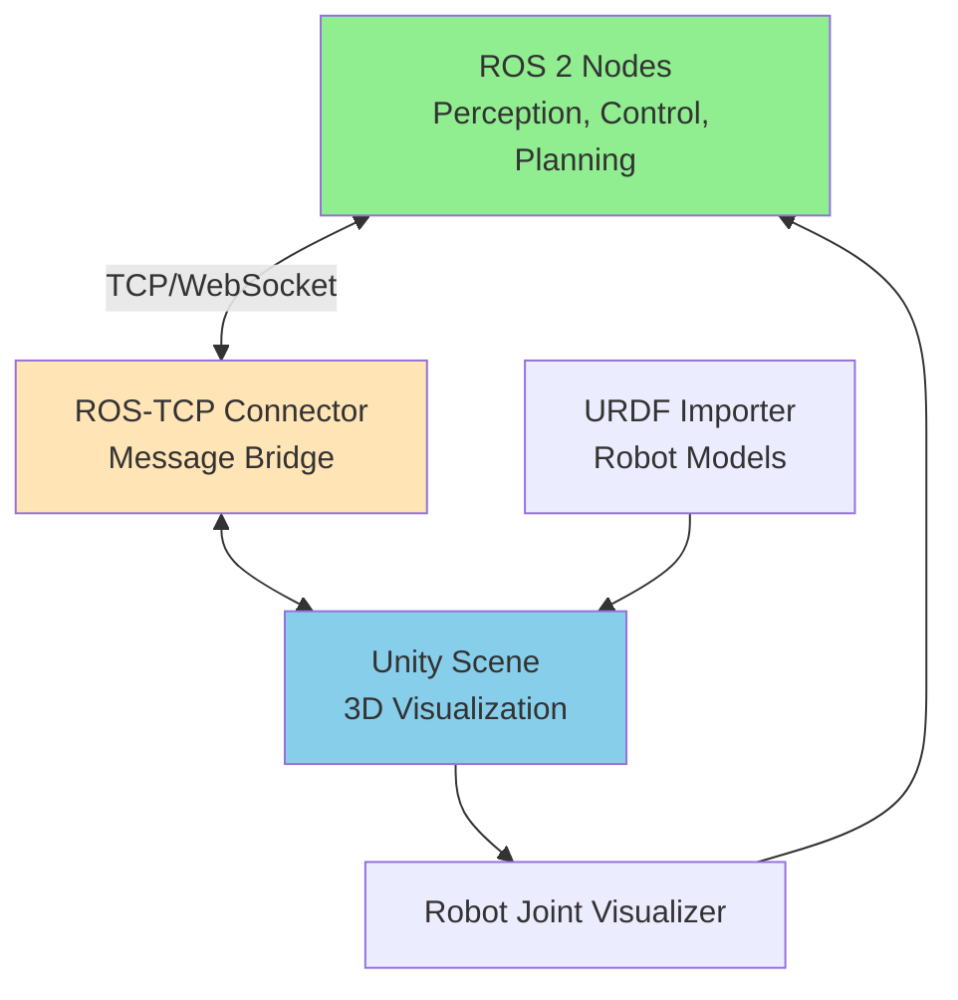
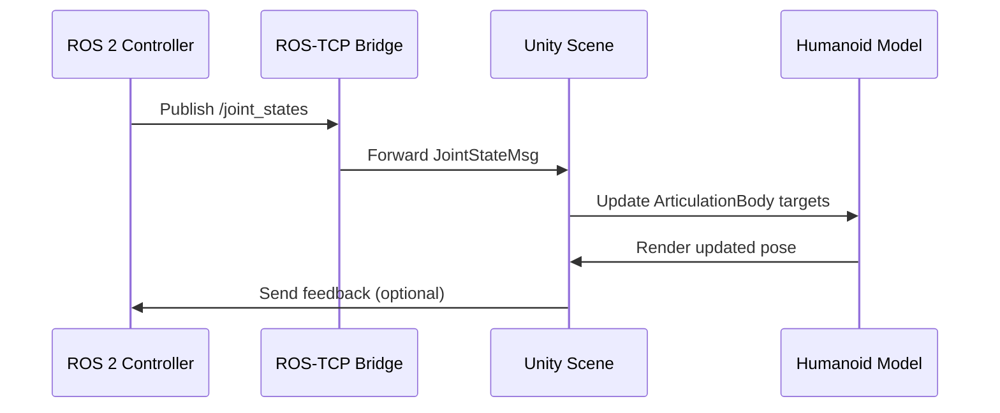
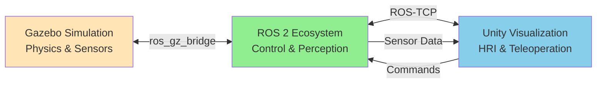

# Chapter 9: Unity Visualization for Robotics

## 9.1 Why Unity for Robotics?

While Gazebo excels at physics simulation, **Unity** offers complementary strengths that make it invaluable for humanoid robotics development:

### Unity's Advantages

*   **Photorealistic Rendering**: Advanced graphics for human-robot interaction (HRI) studies
*   **Cross-Platform Deployment**: AR/VR support for immersive teleoperation
*   **Rich Asset Ecosystem**: Massive library of 3D models, animations, and environments
*   **User Interface Tools**: Built-in UI framework for control dashboards and monitoring
*   **Performance**: Optimized rendering pipeline for real-time visualization
*   **Accessibility**: Widely used in game development, extensive documentation and community

### When to Choose Unity vs. Gazebo

| Criterion | Gazebo | Unity |
|-----------|--------|-------|
| **Physics Accuracy** | Excellent | Good |
| **Rendering Quality** | Good | Excellent |
| **ROS 2 Integration** | Native | Via Unity Robotics Hub |
| **Sensor Simulation** | Comprehensive | Good (improving) |
| **AR/VR Support** | Limited | Excellent |
| **Learning Curve** | Moderate | Moderate-High |
| **Best For** | Physics-accurate simulation | Visualization, HRI, teleoperation |

**Ideal Workflow**: Use Gazebo for physics/sensor simulation, Unity for visualization and user interaction.

## 9.2 Unity Robotics Hub Architecture

The **Unity Robotics Hub** is an official suite of tools that bridges Unity and ROS 2:



**Figure 9.1**: Unity Robotics Hub architecture connecting ROS 2 and Unity.

### Core Components

1.  **ROS-TCP Connector**: Bidirectional communication between Unity and ROS 2
2.  **URDF Importer**: Imports ROS URDF files directly into Unity
3.  **Robot Joint Control**: Visualizes and controls robot articulations
4.  **Sensor Visualizers**: Displays camera feeds, LiDAR scans, etc.

## 9.3 Setting Up Unity for ROS 2

### Prerequisites

*   **Unity Editor**: 2021.3 LTS or later (Download from [unity.com](https://unity.com))
*   **Operating System**: Windows, macOS, or Linux
*   **ROS 2**: Humble Hawksbill or later
*   **Python 3**: For ROS-TCP endpoint

### Installation Steps

#### Step 1: Install Unity

```bash
# On Ubuntu (via Unity Hub)
wget -qO - https://hub.unity3d.com/linux/repos/deb/public.key | sudo apt-key add -
sudo apt-add-repository 'deb https://hub.unity3d.com/linux/repos/deb stable main'
sudo apt update
sudo apt install unityhub
```

**Recommended**: Download Unity Hub from the official website for a streamlined installation.

#### Step 2: Create a New Unity Project

1.  Open Unity Hub
2.  Click **New Project**
3.  Select **3D (URP)** template (Universal Render Pipeline for better performance)
4.  Name: `HumanoidVisualization`
5.  Click **Create Project**

#### Step 3: Install Unity Robotics Hub Packages

In Unity Editor:

1.  Open **Window → Package Manager**
2.  Click **+ → Add package from git URL**
3.  Add the following packages:

```text
https://github.com/Unity-Technologies/ROS-TCP-Connector.git?path=/com.unity.robotics.ros-tcp-connector
https://github.com/Unity-Technologies/URDF-Importer.git?path=/com.unity.robotics.urdf-importer
https://github.com/Unity-Technologies/Robotics-Visualizations.git?path=/com.unity.robotics.visualizations
```

#### Step 4: Set Up ROS-TCP Endpoint in ROS 2

```bash
# Create a ROS 2 workspace
mkdir -p ~/ros2_unity_ws/src
cd ~/ros2_unity_ws/src

# Clone ROS-TCP Endpoint
git clone https://github.com/Unity-Technologies/ROS-TCP-Endpoint.git

# Build the workspace
cd ~/ros2_unity_ws
colcon build
source install/setup.bash

# Run the endpoint (default port: 10000)
ros2 run ros_tcp_endpoint default_server_endpoint
```

#### Step 5: Configure Unity Connection

In Unity Editor:

1.  Go to **Robotics → ROS Settings**
2.  Set **ROS IP Address**: `127.0.0.1` (localhost) or your ROS 2 machine's IP
3.  Set **ROS Port**: `10000`
4.  Set **Protocol**: `ROS 2`

## 9.4 Importing URDF Humanoid Models into Unity

### Preparing Your URDF

Ensure your URDF includes:
*   Visual meshes (`.dae`, `.stl`, `.obj`)
*   Proper material definitions
*   Joint configurations with limits

### Importing Process

1.  In Unity, go to **Assets → Import Robot from URDF**
2.  Select your URDF file (e.g., `humanoid.urdf`)
3.  Unity will automatically:
    *   Parse the URDF structure
    *   Import mesh files
    *   Create GameObjects for each link
    *   Configure Unity joints to match URDF joints

### URDF Import Settings

```csharp
// Example: Configure URDF import programmatically
using Unity.Robotics.UrdfImporter;

public class HumanoidImporter : MonoBehaviour
{
    public string urdfPath = "Assets/URDF/humanoid.urdf";

    void Start()
    {
        var importer = new UrdfRobot();
        importer.ImportRobotFromFile(urdfPath);
    }
}
```

### Post-Import Adjustments

*   **Rigidbody**: Unity adds Rigidbody components for physics
*   **Articulation Body**: For more accurate joint physics (recommended for humanoids)
*   **Materials**: Apply Unity materials for better visuals
*   **Colliders**: Verify collision meshes are correct

## 9.5 Visualizing ROS 2 Data in Unity

### Subscribing to ROS 2 Topics

```csharp
using RosMessageTypes.Sensor;
using Unity.Robotics.ROSTCPConnector;
using UnityEngine;

public class CameraVisualizer : MonoBehaviour
{
    private ROSConnection ros;
    public string cameraTopicName = "/camera/image_raw";
    private Texture2D cameraTexture;

    void Start()
    {
        ros = ROSConnection.GetOrCreateInstance();
        ros.Subscribe<ImageMsg>(cameraTopicName, DisplayImage);

        cameraTexture = new Texture2D(640, 480, TextureFormat.RGB24, false);
    }

    void DisplayImage(ImageMsg message)
    {
        // Load image data into texture
        cameraTexture.LoadRawTextureData(message.data);
        cameraTexture.Apply();

        // Display on a UI element or 3D plane
        GetComponent<Renderer>().material.mainTexture = cameraTexture;
    }
}
```

### Publishing to ROS 2 from Unity

```csharp
using RosMessageTypes.Geometry;
using Unity.Robotics.ROSTCPConnector;
using UnityEngine;

public class UnityTeleopControl : MonoBehaviour
{
    private ROSConnection ros;
    public string cmdVelTopicName = "/cmd_vel";

    void Start()
    {
        ros = ROSConnection.GetOrCreateInstance();
        ros.RegisterPublisher<TwistMsg>(cmdVelTopicName);
    }

    void Update()
    {
        // Example: Send velocity commands based on keyboard input
        float linearX = Input.GetAxis("Vertical") * 0.5f;
        float angularZ = Input.GetAxis("Horizontal") * 1.0f;

        var twist = new TwistMsg
        {
            linear = new Vector3Msg { x = linearX, y = 0, z = 0 },
            angular = new Vector3Msg { x = 0, y = 0, z = angularZ }
        };

        ros.Publish(cmdVelTopicName, twist);
    }
}
```

## 9.6 Real-Time Joint Control and Visualization

### Articulation Body for Humanoid Joints

Unity's `ArticulationBody` provides accurate multi-DOF joint simulation:

```csharp
using UnityEngine;

public class JointController : MonoBehaviour
{
    private ArticulationBody[] joints;

    void Start()
    {
        // Get all articulation bodies in the robot hierarchy
        joints = GetComponentsInChildren<ArticulationBody>();
    }

    public void SetJointPosition(int jointIndex, float targetPosition)
    {
        if (jointIndex >= joints.Length) return;

        var joint = joints[jointIndex];
        var drive = joint.xDrive;
        drive.target = targetPosition * Mathf.Rad2Deg;  // Convert to degrees
        joint.xDrive = drive;
    }

    public void SubscribeToJointStates()
    {
        var ros = ROSConnection.GetOrCreateInstance();
        ros.Subscribe<RosMessageTypes.Sensor.JointStateMsg>("/joint_states", UpdateJoints);
    }

    void UpdateJoints(RosMessageTypes.Sensor.JointStateMsg message)
    {
        for (int i = 0; i < message.position.Length && i < joints.Length; i++)
        {
            SetJointPosition(i, (float)message.position[i]);
        }
    }
}
```

### Visualizing Joint States



**Figure 9.2**: Real-time joint state synchronization between ROS 2 and Unity.

## 9.7 Advanced Unity Features for Robotics

### 1. AR/VR Teleoperation

```csharp
using UnityEngine.XR;
using UnityEngine.XR.Interaction.Toolkit;

public class VRTeleop : MonoBehaviour
{
    public XRController rightController;
    private ROSConnection ros;

    void Start()
    {
        ros = ROSConnection.GetOrCreateInstance();
        ros.RegisterPublisher<TwistMsg>("/cmd_vel");
    }

    void Update()
    {
        // Get VR controller input
        Vector2 thumbstick = Vector2.zero;
        rightController.inputDevice.TryGetFeatureValue(
            CommonUsages.primary2DAxis, out thumbstick
        );

        // Send as robot velocity command
        var twist = new TwistMsg
        {
            linear = new Vector3Msg { x = thumbstick.y, y = 0, z = 0 },
            angular = new Vector3Msg { x = 0, y = 0, z = thumbstick.x }
        };

        ros.Publish("/cmd_vel", twist);
    }
}
```

### 2. Point Cloud Visualization

```csharp
using RosMessageTypes.Sensor;
using UnityEngine;

public class PointCloudRenderer : MonoBehaviour
{
    private ParticleSystem particles;
    private ParticleSystem.Particle[] pointCloudParticles;

    void Start()
    {
        particles = GetComponent<ParticleSystem>();
        var ros = ROSConnection.GetOrCreateInstance();
        ros.Subscribe<PointCloud2Msg>("/points", RenderPointCloud);
    }

    void RenderPointCloud(PointCloud2Msg message)
    {
        int numPoints = (int)(message.width * message.height);
        pointCloudParticles = new ParticleSystem.Particle[numPoints];

        // Parse point cloud data and create particles
        // (Simplified - actual parsing depends on point cloud format)
        for (int i = 0; i < numPoints; i++)
        {
            pointCloudParticles[i].position = new Vector3(
                /* Extract x, y, z from message.data */
            );
            pointCloudParticles[i].startColor = Color.white;
            pointCloudParticles[i].startSize = 0.01f;
        }

        particles.SetParticles(pointCloudParticles, numPoints);
    }
}
```

### 3. Custom Control Dashboard

```csharp
using UnityEngine.UI;

public class ControlDashboard : MonoBehaviour
{
    public Slider speedSlider;
    public Text statusText;
    public Button emergencyStopButton;

    private ROSConnection ros;

    void Start()
    {
        ros = ROSConnection.GetOrCreateInstance();

        emergencyStopButton.onClick.AddListener(EmergencyStop);
        speedSlider.onValueChanged.AddListener(UpdateSpeed);

        // Subscribe to robot status
        ros.Subscribe<RosMessageTypes.Std.StringMsg>("/robot_status", UpdateStatus);
    }

    void UpdateSpeed(float value)
    {
        // Send max speed parameter to ROS 2
        var speedMsg = new RosMessageTypes.Std.Float32Msg { data = value };
        ros.Publish("/max_speed", speedMsg);
    }

    void EmergencyStop()
    {
        // Send stop command
        var stopMsg = new RosMessageTypes.Std.BoolMsg { data = true };
        ros.Publish("/emergency_stop", stopMsg);
        statusText.text = "EMERGENCY STOP ACTIVATED";
    }

    void UpdateStatus(RosMessageTypes.Std.StringMsg message)
    {
        statusText.text = message.data;
    }
}
```

## 9.8 Performance Optimization in Unity

### Best Practices

1.  **Use URP (Universal Render Pipeline)**: Better performance than built-in renderer
2.  **Optimize Meshes**: Reduce polygon count for robot models
3.  **Level of Detail (LOD)**: Use LOD groups for distant objects
4.  **Occlusion Culling**: Enable to avoid rendering hidden objects
5.  **Limit Update Rates**: Subscribe to ROS topics at 10-30 Hz, not every frame
6.  **Use Object Pooling**: For dynamic elements (particle systems, UI elements)

### Profiling Unity Performance

```csharp
using UnityEngine.Profiling;

public class PerformanceMonitor : MonoBehaviour
{
    void Update()
    {
        // Monitor frame time
        float frameTime = Time.deltaTime * 1000f;  // ms
        if (frameTime > 33.0f)  // Below 30 FPS
        {
            Debug.LogWarning($"Performance issue: Frame time {frameTime}ms");
        }

        // Check memory usage
        long totalMemory = Profiler.GetTotalAllocatedMemoryLong() / (1024 * 1024);  // MB
        Debug.Log($"Total Memory: {totalMemory} MB");
    }
}
```

## 9.9 Hybrid Workflow: Gazebo + Unity

### Optimal Setup for Humanoid Development



**Figure 9.3**: Hybrid architecture leveraging Gazebo for physics and Unity for visualization.

### Example Use Cases

1.  **Training**: Gazebo generates realistic sensor data → ROS 2 runs AI models → Unity visualizes results
2.  **Teleoperation**: Unity provides VR interface → ROS 2 processes commands → Gazebo/physical robot executes
3.  **Debugging**: Gazebo runs physics → ROS 2 logs data → Unity displays 3D visualization for analysis

### Launch File for Hybrid Setup

```python
# launch/hybrid_simulation.launch.py
from launch import LaunchDescription
from launch.actions import IncludeLaunchDescription
from launch_ros.actions import Node

def generate_launch_description():
    return LaunchDescription([
        # Launch Gazebo
        IncludeLaunchDescription('gazebo_humanoid.launch.py'),

        # Launch ROS-TCP Endpoint for Unity
        Node(
            package='ros_tcp_endpoint',
            executable='default_server_endpoint',
            name='unity_bridge',
            parameters=[{'ROS_IP': '0.0.0.0', 'ROS_TCP_PORT': 10000}]
        ),

        # Launch controller nodes
        Node(
            package='humanoid_control',
            executable='motion_planner',
            name='motion_planner'
        )
    ])
```

## 9.10 Limitations and Considerations

### Unity Constraints for Robotics

*   **Physics Accuracy**: Not as precise as Gazebo for complex dynamics
*   **Real-Time Guarantees**: Unity is designed for games, not real-time control
*   **Sensor Simulation**: Limited compared to Gazebo (improving with Unity Simulation Pro)
*   **Learning Curve**: Requires C# knowledge and Unity Editor familiarity

### When NOT to Use Unity

*   Developing low-level control algorithms (use Gazebo)
*   Validating sensor accuracy (use Gazebo)
*   Running headless CI/CD tests (use Gazebo headless mode)
*   Training RL agents with precise physics (use Gazebo or Isaac Sim)

## Summary

Unity provides a powerful visualization platform for humanoid robotics, excelling in:
*   Photorealistic rendering for human-robot interaction studies
*   AR/VR integration for immersive teleoperation
*   Custom UI development for control dashboards
*   Cross-platform deployment (desktop, mobile, VR)

When combined with Gazebo's physics simulation and ROS 2's middleware, Unity completes a comprehensive robotics development ecosystem. The Unity Robotics Hub makes integration straightforward, enabling developers to leverage the best of both platforms.

In the next chapter, we will explore best practices for building realistic simulation environments that bridge the gap between virtual testing and real-world deployment.

## Further Reading

*   [Unity Robotics Hub Documentation](https://github.com/Unity-Technologies/Unity-Robotics-Hub)
*   [ROS-TCP Connector Guide](https://github.com/Unity-Technologies/ROS-TCP-Connector)
*   [Unity for Robotics Tutorials](https://learn.unity.com/project/unity-robotics-hub)
*   Yan, Q., et al. (2021). "Unity-ROS Integration for Robotics Applications." *IEEE Robotics and Automation Letters*.
