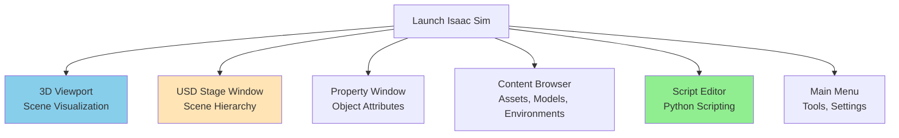

# Chapter 11: Introduction to NVIDIA Isaac Platform

## 11.1 The NVIDIA Isaac Ecosystem for Robotics

NVIDIA's **Isaac platform** is a comprehensive suite of hardware, software, and tools designed to accelerate the development and deployment of AI-powered robots, especially in complex areas like humanoid robotics. It integrates NVIDIA's expertise in GPUs, AI, and simulation to provide a full-stack solution for robotics developers.

### Key Components of the Isaac Platform

```mermaid
mindmap
  root((NVIDIA Isaac Platform))
    Isaac Sim
      Photorealistic simulation
      USD-based (Omniverse)
      Physics (PhysX 5)
      Synthetic data generation
    Isaac ROS
      GPU-accelerated ROS 2 packages
      Perception (VSLAM, DNNs)
      Navigation (Nav2 integration)
      Manipulation
    Isaac SDK
      (Legacy) Robotics application framework
    Jetson Platform
      Embedded AI computers (Orin, Xavier)
      Edge processing
    Cloud Integration
      Fleet management
      MLOps for robotics
```

**Figure 11.1**: Overview of the NVIDIA Isaac Platform and its key components.

### Why Isaac for Humanoid Robotics?

*   **Performance**: Leverages NVIDIA GPUs for high-speed simulation, AI inference, and data processing.
*   **Fidelity**: Isaac Sim provides high-fidelity, photorealistic environments for accurate perception and realistic training.
*   **Scalability**: Built for large-scale simulation and multi-robot deployments.
*   **AI Integration**: Seamlessly integrates with AI frameworks (TensorFlow, PyTorch) and NVIDIA's AI models.
*   **ROS 2 Compatibility**: Isaac ROS provides optimized ROS 2 packages.
*   **Sim-to-Real Transfer**: Tools and techniques to bridge the gap between simulation and physical robots.

## 11.2 NVIDIA Isaac Sim: The Robotics Simulator

**Isaac Sim** is a powerful robotics simulation platform built on NVIDIA Omniverse, a universal platform for virtual collaboration and physically accurate simulations. It allows developers to:

*   Create, test, and deploy AI-powered robots.
*   Generate massive amounts of synthetic data for training deep neural networks.
*   Utilize advanced physics simulation (PhysX 5) and photorealistic rendering (RTX).

### Core Technologies in Isaac Sim

#### 1. Universal Scene Description (USD)

**USD** (Universal Scene Description) is a powerful, open-source 3D scene description technology developed by Pixar. It forms the foundation of NVIDIA Omniverse and Isaac Sim. USD enables:

*   **Interoperability**: Exchange 3D data between various applications (Blender, Maya, CAD tools).
*   **Scalability**: Handles extremely complex scenes with millions of assets.
*   **Composition**: Non-destructive layering and overriding of scene data.
*   **Collaboration**: Multiple users can work on the same scene simultaneously.

**Analogy**: Think of USD as the "HTML for 3D worlds" or "Git for 3D assets."

#### 2. NVIDIA RTX GPUs

**NVIDIA RTX GPUs** provide the computational power for Isaac Sim's advanced features:

*   **Real-time Ray Tracing**: For photorealistic rendering, accurate shadows, reflections, and global illumination.
*   **AI Acceleration**: Tensor Cores for high-performance AI inference (e.g., in Isaac ROS).
*   **CUDA**: Parallel computing platform for physics simulations and custom algorithms.

#### 3. PhysX 5

**PhysX 5** is NVIDIA's advanced physics engine, providing highly accurate and stable simulation for rigid bodies, soft bodies, fluids, and cloth. In Isaac Sim, PhysX 5 ensures:

*   **Realistic Contacts**: Essential for humanoid robot interaction with the environment.
*   **Stable Dynamics**: Prevents common simulation instabilities like jitter or explosions.
*   **Deformable Bodies**: For simulating flexible robot parts or soft objects.

### Isaac Sim Interface Overview



**Figure 11.2**: Main interface components of NVIDIA Isaac Sim.

## 11.3 Getting Started with Isaac Sim

### Prerequisites

*   **NVIDIA GPU**: RTX 20 Series or newer (RTX 30/40 Series recommended)
*   **Operating System**: Ubuntu 20.04/22.04 or Windows 10/11
*   **NVIDIA Driver**: Latest proprietary driver
*   **Docker** (Recommended for Linux)

### Installation Steps (Ubuntu/Docker)

#### Option 1: Docker Installation (Recommended for Linux)

1.  **Install Docker and NVIDIA Container Toolkit**: Follow official NVIDIA documentation.

    ```bash
    # Example: Install NVIDIA Docker (refer to official docs for latest)
    distribution=$(. /etc/os-release;echo $ID$VERSION_ID)
    curl -s -L https://nvidia.github.io/nvidia-container-runtime/gpgkey | sudo apt-key add -
    curl -s -L https://nvidia.github.io/nvidia-container-runtime/$distribution/nvidia-container-runtime.list | sudo tee /etc/apt/sources.list.d/nvidia-container-runtime.list
    sudo apt update
    sudo apt install -y nvidia-docker2
    sudo systemctl restart docker
    ```

2.  **Pull Isaac Sim Docker Image**: Obtain credentials from NVIDIA Developer program.

    ```bash
    # Log in to NVIDIA NGC Docker registry
    docker login nvcr.io

    # Pull Isaac Sim image (replace TAG with latest)
    docker pull nvcr.io/nvidia/isaac-sim:2023.1.1
    ```

3.  **Launch Isaac Sim Container**:

    ```bash
    # Example launch command (adjust as needed)
    docker run --gpus all -e "ACCEPT_EULA=Y" --network host -it nvcr.io/nvidia/isaac-sim:2023.1.1
    ```

#### Option 2: Native Installation (Windows/Ubuntu)

1.  **Download Omniverse Launcher**: From [nvidia.com/omniverse](https://developer.nvidia.com/omniverse).
2.  **Install Isaac Sim**: Use the Launcher to install Isaac Sim from the "Exchange" tab.

### Post-Installation Verification

*   Launch Isaac Sim.
*   Open a sample scene (e.g., `isaac_assets/Scenes/Simple_Warehouse.usd`).
*   Ensure the 3D viewport renders correctly and physics simulation runs.

## 11.4 Core Concepts: USD, Stages, and Prims

### 1. USD Stage

A **USD Stage** is the root of an Omniverse scene. It contains all the 3D data, including:
*   Models (robots, environments, objects)
*   Materials, textures
*   Lights, cameras
*   Simulation properties

### 2. Prims (Primitives)

**Prims** are the fundamental building blocks of a USD Stage. Every object, light, camera, or even an attribute is a prim. Prims are organized hierarchically, similar to a file system or scene graph.

```text
/World
├── /Environments
│   └── /Warehouse
├── /Robots
│   ├── /HumanoidRobot
│   │   ├── /base_link
│   │   ├── /torso_link
│   │   └── /head_link
│   └── /OtherRobot
├── /Lights
│   └── /SunLight
└── /Camera
    └── /MainCamera
```

### 3. Layers and References

USD uses a powerful layering system, allowing multiple USD files to be composed non-destructively:

*   **Root Layer**: The primary USD file.
*   **SubLayers**: Additional USD files that add or override properties.
*   **References**: Link external USD assets (e.g., robot models, environment props) into the current stage.

This enables modularity and collaborative workflows.

## 11.5 Python Scripting in Isaac Sim

Isaac Sim is highly scriptable with Python, allowing automation of:
*   Scene construction
*   Robot control
*   Synthetic data generation
*   Simulation management

### Basic Python Scripting Example

```python
import omni.usd
from omni.isaac.core import World
from omni.isaac.core.objects import DynamicCuboid
import numpy as np

# Initialize Isaac Sim world
world = World(stage_units_in_meters=1.0)
world.scene.add_default_ground_plane()

# Add a dynamic cuboid (robot's base)
cuboid = world.scene.add(
    DynamicCuboid(
        prim_path="/World/Cube",
        position=np.array([0, 0, 1.0]),
        scale=np.array([0.5, 0.5, 0.5]),
        size=0.5,
        color=np.array([0, 0, 0.5]),
    )
)

# Start simulation
world.reset()

# Simulation loop
for i in range(1000):
    world.step(render=True)  # Advance simulation and render
    if i == 500:
        # Apply force to cuboid after 500 steps
        cuboid.apply_velocity_actions(np.array([1.0, 0.0, 0.0]))

print("Simulation finished.")
```

### ROS 2 Integration with Isaac Sim

Isaac Sim provides built-in ROS 2 bridges for:
*   Publishing sensor data (camera, LiDAR, IMU)
*   Subscribing to command topics (joint control, twist commands)
*   Loading URDF robots with `ros2_control` integration.

```python
# Isaac Sim Python: ROS 2 node example (conceptual)
from omni.isaac.core.articulations import Articulation
from omni.isaac.ros2_bridge import ROS2Context, ROS2MsgConverter
from sensor_msgs.msg import JointState
import rclpy

class HumanoidROS2Control:
    def __init__(self, robot_prim_path):
        self.robot = Articulation(prim_path=robot_prim_path, name="my_humanoid")
        self.ros_context = ROS2Context()
        self.ros_node = rclpy.create_node("isaac_humanoid_node")

        self.joint_state_pub = self.ros_node.create_publisher(JointState, "/joint_states", 10)

    def update_robot(self):
        joint_positions = self.robot.get_joint_positions()
        # Publish joint states
        joint_state_msg = JointState()
        joint_state_msg.position = joint_positions
        self.joint_state_pub.publish(joint_state_msg)

# In main simulation loop:
humanoid_controller.update_robot()
rclpy.spin_once(humanoid_controller.ros_node, timeout_sec=0.0)
```

## 11.6 Building Your First Isaac Sim Scene

### Step 1: Launch Isaac Sim

Use the Docker command or Omniverse Launcher.

### Step 2: Create a New Stage

**File → New Stage**

### Step 3: Add a Ground Plane

**Create → Physics → Ground Plane**

### Step 4: Import a Humanoid Robot Model

1.  **Content Browser**: Navigate to `isaac_assets/Robots/Franka` (or another humanoid asset if available).
2.  Drag and drop the USD file (e.g., `franka_alt_fingers.usd`) into the viewport.
3.  Position the robot above the ground plane.

### Step 5: Add a Light Source

**Create → Light → Dome Light** (for ambient lighting) or **Rect Light** (for directional).

### Step 6: Configure Physics

1.  Select the robot in the **Stage** window.
2.  In the **Property** window, ensure `Collision` and `Articulation Root` components are enabled.
3.  **Window → Physics → Scene** and adjust `Gravity` or `Solver` settings if needed.

### Step 7: Run Simulation

Click the **Play** button in the top toolbar to start the physics simulation.

## Summary

NVIDIA Isaac Platform, centered around Isaac Sim, offers an unparalleled environment for developing and testing AI-powered humanoid robots. By leveraging USD, RTX GPUs, and PhysX 5, Isaac Sim provides:
*   Photorealistic, high-fidelity simulation environments.
*   Powerful Python scripting for automation.
*   Seamless integration with ROS 2 for robot control and perception.
*   Tools for synthetic data generation crucial for advanced AI training.

This foundation is essential for bridging the sim-to-real gap and accelerating the deployment of complex humanoid robotics. The modular nature of USD and Omniverse facilitates collaborative workflows and scalable scene creation.

In the next chapter, we will dive deeper into perception pipelines within Isaac Sim, focusing on how synthetic data generation and Isaac ROS can be used to train robust AI models for humanoid vision and sensing.

## Further Reading

*   [NVIDIA Isaac Sim Documentation](https://docs.omniverse.nvidia.com/isaacsim/latest/index.html)
*   [NVIDIA Omniverse USD Primer](https://docs.omniverse.nvidia.com/prod_usd/latest/index.html)
*   [ROS 2 in Isaac Sim Tutorials](https://docs.omniverse.nvidia.com/isaacsim/latest/ros_tutorials.html)
