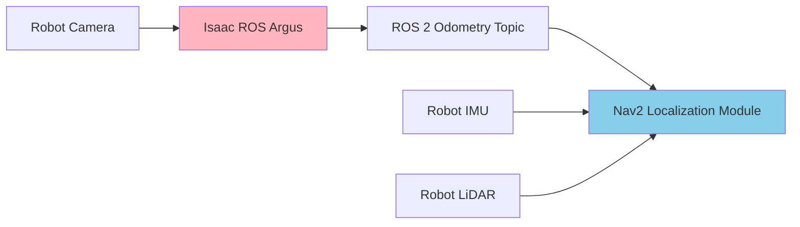

# Chapter 14: Navigation with Nav2

## 14.1 Autonomous Navigation for Humanoid Robots

**Autonomous navigation** is a cornerstone of intelligent robotics, allowing robots to move purposefully and safely through environments. For humanoid robots, navigation is particularly challenging due to their complex kinematics, dynamic balance requirements, and need to interact in human-centric spaces.

**Nav2** is the ROS 2 navigation stack, providing a flexible and powerful framework for mobile robot navigation. It integrates various modules for localization, global planning, local planning, and obstacle avoidance, making it highly suitable for humanoid applications.

### Why Nav2 for Humanoids?

*   **Modularity**: Customizable and extensible modules for different locomotion styles.
*   **Safety**: Integrated obstacle avoidance and recovery behaviors.
*   **Dynamic Environments**: Adapts to moving obstacles and changes in the environment.
*   **Integration**: Seamlessly integrates with ROS 2 sensors (LiDAR, cameras, IMU) and control systems.
*   **Path Planning**: Generates efficient and collision-free paths.

## 14.2 Nav2 Architecture Overview

Nav2 follows a behavior tree-based architecture, allowing for flexible and robust navigation behaviors.

```mermaid
graph TD
    Start[User Command / Goal] --> BehaviorTree[Behavior Tree Navigator]

    BehaviorTree --> Localizer[Localization<br/>(AMCL, Lidar/Visual Odom)]
    BehaviorTree --> Mapper[Mapping<br/>(SLAM Toolbox)]
    BehaviorTree --> GlobalPlanner[Global Planning<br/>(A*, Dijkstra)]
    BehaviorTree --> Controller[Local Planning/Controller<br/>(DWB, TEB)]
    BehaviorTree --> Recovery[Recovery Behaviors<br/>(Clear Costmaps)]

    Localizer --> Costmap[Costmap 2D]
    Mapper --> Costmap
    Controller --> Costmap
    GlobalPlanner --> Costmap

    Sensors[Robot Sensors] --> Costmap
    Control[Robot Control Interface] --> Controller

    style BehaviorTree fill:#FFE4B5
    style GlobalPlanner fill:#87CEEB
    style Controller fill:#90EE90
    style Costmap fill:#FFB6C1
```

**Figure 14.1**: Overview of the Nav2 architecture and its core components.

### Core Components

1.  **Behavior Tree Navigator**: Orchestrates navigation tasks (e.g., `navigate_to_pose`, `follow_path`).
2.  **Localizer**: Estimates the robot's pose (position and orientation) within a map (e.g., AMCL for LiDAR, visual odometry).
3.  **Mapper**: Builds and maintains a map of the environment (e.g., SLAM Toolbox).
4.  **Global Planner**: Generates a long-term, collision-free path from start to goal (e.g., A*, Dijkstra).
5.  **Local Planner/Controller**: Executes the global path, avoids local obstacles, and maintains dynamic stability (e.g., DWB, TEB).
6.  **Costmap 2D**: Represents the environment as a grid, indicating obstacles and safe areas for navigation.
7.  **Recovery Behaviors**: Handles situations where the robot gets stuck or encounters unexpected obstacles.

## 14.3 Localization and Mapping for Humanoids

### 1. Adaptive Monte Carlo Localization (AMCL)

**AMCL** is a probabilistic localization algorithm used to estimate a robot's pose within a known map using LiDAR scans. For humanoids, AMCL provides robust localization even with complex leg movements.

```python
# Conceptual AMCL parameters (YAML)
amcl:
  ros__parameters:
    min_particles: 500
    max_particles: 2000
    kld_err: 0.05
    update_min_d: 0.2
    update_min_a: 0.5
    initial_pose_x: 0.0
    initial_pose_y: 0.0
    initial_pose_a: 0.0
    laser_model_type: likelihood_field
    transform_tolerance: 0.1
    gui_publish_rate: 10.0
```

### 2. SLAM Toolbox

**SLAM Toolbox** is a robust 2D / 3D Simultaneous Localization and Mapping solution for ROS 2. It allows humanoids to build a map of an unknown environment while simultaneously localizing themselves within it.

*   **Online SLAM**: Builds the map in real-time.
*   **Loop Closure**: Corrects drift by recognizing previously visited locations.
*   **Mapping for Navigation**: Generated maps are used by Nav2 for global planning.

```bash
# Launch SLAM Toolbox
ros2 launch slam_toolbox online_async_launch.py params_file:=slam_params.yaml

# Save map after mapping
ros2 run nav2_map_server map_saver_cli -f my_humanoid_map
```

### 3. Visual Odometry (Integration with Isaac ROS)

For humanoids with cameras, visual odometry (e.g., from Isaac ROS Argus) provides highly accurate local pose estimates. Nav2 can integrate these odometry sources.



**Figure 14.2**: Fusing visual odometry with other sensors for robust humanoid localization.

## 14.4 Global Planning for Humanoid Traversal

**Global planners** generate a collision-free path from the robot's current location to a designated goal, considering the static map of the environment.

### 1. NavFn and Planner Server

Nav2 includes global planners like **NavFn** (a variant of Dijkstra's algorithm) that compute efficient paths through the costmap.

### 2. Global Path Planning for Humanoids

*   **Footstep Planning**: For bipedal robots, global planners need to consider feasible footstep locations and body stability constraints.
*   **Stair Climbing**: Path planning must account for traversable stairs or ramps.
*   **Narrow Passages**: Generate paths that fit the humanoid's body dimensions.

```python
# Conceptual global planner parameters for humanoid (YAML)
global_planner:
  ros__parameters:
    plugin_names: ["GridBased"] # A* or Dijkstra
    GridBased:
      plugin: "nav2_navfn_planner/NavfnPlanner"
      costmap_topic: "global_costmap/costmap"
      # ... other parameters
      tolerance: 0.5 # Distance to goal tolerance
```

## 14.5 Local Planning and Control for Humanoid Motion

**Local planners (controllers)** track the global path while dynamically avoiding obstacles and maintaining the robot's stability. They generate short-term velocity commands.

### 1. DWB (Dynamic Window Approach Based) Controller

**DWB** is a powerful local planner that samples robot velocities and simulates their trajectories to find the best collision-free and goal-reaching motion. It can be configured for humanoid gait.

```python
# Conceptual DWB controller parameters (YAML)
dwb_controller:
  ros__parameters:
    max_vel_x: 0.3          # Max forward speed (m/s)
    min_vel_x: -0.1         # Max backward speed (m/s)
    max_vel_y: 0.0          # No sideways motion for biped
    max_rot_vel: 0.5        # Max angular speed (rad/s)
    min_rot_vel: -0.5
    acc_lim_x: 0.5
    acc_lim_y: 0.0
    acc_lim_theta: 1.0
    enable_short_queue_replanning: true
    prune_history: true
    # ... other DWB parameters

    # For humanoid specific gait
    transform_tolerance: 0.1
    goal_dist_tol: 0.1
    path_dist_tol: 0.1
    # ... gait specific parameters if extended
```

### 2. TEB (Timed Elastic Band) Local Planner

**TEB** optimizes the robot's trajectory by considering time and dynamically adjusting the path to avoid obstacles while respecting kinematic and dynamic constraints. It can generate smoother paths than DWB.

### 3. Costmaps for Humanoids

**Costmaps** are grid-based representations of the environment, where each cell contains a cost indicating its traversability. Nav2 uses two costmaps:

*   **Global Costmap**: Static, built from the environment map, for global planning.
*   **Local Costmap**: Dynamic, built from real-time sensor data, for local planning and obstacle avoidance.

For humanoids, costmaps need to be configured to respect body shape and stability:

*   **Inflation Layer**: Inflates obstacles by the robot's footprint.
*   **Voxel Layer**: Uses 3D sensor data to create a 3D costmap, crucial for humanoids to detect overhead obstacles or steps.
*   **Height Map Layer**: Can generate traversable areas based on terrain height, assisting with walking over uneven ground.

```python
# Conceptual costmap parameters (YAML)
global_costmap:
  ros__parameters:
    plugins: ["static_layer", "obstacle_layer", "inflation_layer"]
    static_layer:
      plugin: "nav2_costmap_2d::StaticLayer"
      map_subscribe_duration: 35.0
      # ...
    obstacle_layer:
      plugin: "nav2_costmap_2d::ObstacleLayer"
      observation_sources: "scan_sensor point_cloud_sensor"
      scan_sensor:
        topic: "/scan"
        max_obstacle_height: 2.0 # Humanoid height
        inf_is_valid: true
        # ...
    inflation_layer:
      plugin: "nav2_costmap_2d::InflationLayer"
      inflation_radius: 0.5 # Robot footprint radius
      cost_scaling_factor: 3.0
```

## 14.6 Nav2 Configuration for Humanoid Platforms

### 1. Robot Footprint and Body Dimensions

Crucial for obstacle avoidance. Define the humanoid's polygonal footprint in the costmap configuration.

```yaml
footprint:
  - [0.2, 0.2]
  - [0.2, -0.2]
  - [-0.2, -0.2]
  - [-0.2, 0.2]
```

### 2. Recovery Behaviors

Nav2 includes default recovery behaviors like clearing costmaps or rotating in place. For humanoids, custom recovery behaviors might involve:

*   **Balance Recovery**: Specific motions to regain stability.
*   **Stuck Recovery**: Backing up or stepping aside if blocked.
*   **Fall Recovery**: Executing a predefined sequence to stand up.

### 3. Integrating with Humanoid Control

Nav2 outputs `geometry_msgs/Twist` messages (linear and angular velocities). These need to be converted to joint commands for the humanoid's locomotion system.

```mermaid
graph LR
    Nav2[Nav2 Controller<br/>(DWB/TEB)] --> TwistCmd[ROS 2: /cmd_vel]
    TwistCmd --> HumanoidController[Humanoid Locomotion Controller<br/>(Inverse Kinematics, Whole Body Control)] --> JointCommands[Robot Joints]

    style Nav2 fill:#FFE4B5
    style HumanoidController fill:#90EE90
```

**Figure 14.3**: Integrating Nav2 velocity commands with a humanoid's locomotion controller.

## 14.7 Challenges and Best Practices for Humanoid Navigation

### Challenges

*   **Dynamic Stability**: Maintaining balance during complex movements (walking, turning).
*   **Multi-Contact Planning**: Coordinating footsteps and balance over uneven terrain.
*   **Perception Accuracy**: Robustly detecting small obstacles or gaps.
*   **Computational Load**: High-frequency control loops and complex planners.
*   **Human Interaction**: Navigating safely around humans and respecting social norms.

### Best Practices

1.  **High-Fidelity Simulation**: Use Isaac Sim or Gazebo with accurate physics to test navigation.
2.  **Robust Localization**: Fuse multiple sensor modalities (LiDAR, camera, IMU) for accurate pose estimates.
3.  **Humanoid-Specific Planners**: Research and implement planners that account for bipedal locomotion constraints.
4.  **Costmap Tuning**: Carefully configure costmap layers and inflation radius to reflect the humanoid's traversability.
5.  **Recovery Strategies**: Implement specific recovery behaviors for humanoid robots.
6.  **Safety Protocols**: Integrate safety mechanisms to prevent falls or collisions.
7.  **Iterative Testing**: Test navigation in progressively complex environments, from flat ground to uneven terrain and dynamic obstacles.

## Summary

Nav2 provides a powerful and flexible framework for enabling autonomous navigation in humanoid robots. By integrating robust localization, global planning, and local control modules, Nav2 allows humanoids to:

*   **Self-localize** within known or unknown environments.
*   **Generate collision-free paths** to goals.
*   **Dynamically avoid obstacles** while maintaining stability.
*   **Adapt to dynamic changes** in the environment.

Configuring Nav2 for humanoids involves careful tuning of costmaps, physics parameters, and integrating with humanoid-specific locomotion controllers. When combined with advanced perception capabilities from Isaac ROS, Nav2 becomes a critical component in developing intelligent and autonomous humanoid robots.

In the next and final chapter of this module, we will delve into the exciting field of Reinforcement Learning and Sim-to-Real transfer, exploring how humanoids can learn complex behaviors in simulation and seamlessly apply them to the physical world.

## Further Reading

*   [Nav2 Documentation](https://navigation.ros.org/)
*   [ROS 2 Navigation Tutorials](https://docs.ros.org/en/humble/Tutorials/Navigation2/Introducing-Navigation2.html)
*   [Costmap 2D Documentation](https://navigation.ros.org/setup_guides/costmap.html)
*   Hagstette, J., & Schlegel, C. (2018). "A Review of Humanoid Robot Navigation." *Robotics and Autonomous Systems*.
