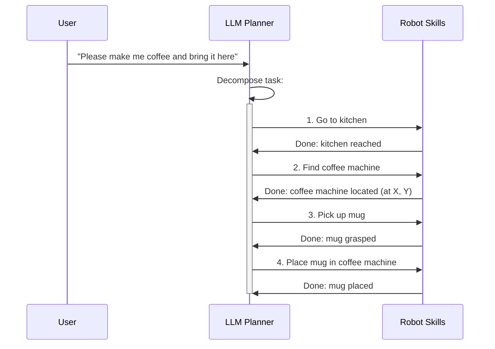

# Chapter 18: LLM-Based Cognitive Planning

## 18.1 The Rise of LLMs in Robotic Cognition

**Large Language Models (LLMs)** have transformed various fields, and their application in robotics, particularly for cognitive planning, is rapidly expanding. LLMs empower humanoid robots with advanced reasoning, task decomposition, and decision-making capabilities that go beyond traditional robotic planners. They bridge the gap between high-level human intent and low-level robot actions.

### Why LLMs for Cognitive Planning?

*   **Natural Language Interface**: Directly understand and execute commands given in natural language.
*   **Commonsense Reasoning**: Leverage vast world knowledge to infer implicit goals, resolve ambiguities, and handle unexpected situations.
*   **Task Decomposition**: Break down complex, high-level tasks into sequences of simpler, executable steps.
*   **Adaptability**: Generate plans that adapt to dynamic environments and changing conditions.
*   **Error Handling**: Can propose recovery strategies or ask clarifying questions when plans fail.

### Traditional vs. LLM-Based Planning

| Feature | Traditional Planners (e.g., PDDL) | LLM-Based Planners |
|---------|------------------------------------|--------------------|
| **Knowledge Rep.** | Explicit, symbolic | Implicit, learned from data |
| **Flexibility** | Rigid, requires domain model | Highly flexible, adaptable |
| **Ambiguity** | Struggles, requires exact input | Handles well, asks for clarification |
| **Reasoning** | Logical, deductive | Inductive, probabilistic |
| **Scalability** | Can be limited by state space | Scales with model size/data |
| **Real-world** | Fragile to unexpected changes | More robust to novelty |

## 18.2 Task Decomposition with LLMs

**Task decomposition** is the process of breaking down a high-level goal into a series of smaller, manageable sub-tasks that a robot can execute. LLMs excel at this by drawing on their understanding of human instructions and world knowledge.

### Example: "Make me coffee"

*   **High-level goal**: `Make coffee`
*   **LLM-generated sub-tasks**:
    1.  `Go to the kitchen`
    2.  `Find the coffee machine`
    3.  `Pick up a mug`
    4.  `Place mug in coffee machine`
    5.  `Press brew button`
    6.  `Add sugar (if requested)`
    7.  `Bring coffee to user`



**Figure 18.1**: LLM-based task decomposition for a "make coffee" command.

### Prompt Engineering for Task Decomposition

Effective task decomposition often relies on well-crafted prompts for the LLM:

```text
**Prompt for LLM:**

"You are a helpful robot assistant. Given a high-level goal, please break it down into a list of concise, executable sub-tasks for a humanoid robot. Focus on actions like 'go to X', 'find Y', 'pick up Z', 'place A on B', 'press C'. Assume the robot has basic locomotion, perception, and manipulation skills. The current environment contains a kitchen with a coffee machine, mugs, and a table.

High-level goal: 'Make me coffee and bring it to the living room.'

Sub-tasks:
1. """
```

The LLM then completes the list of sub-tasks.

## 18.3 Constraint Handling and Replanning

LLMs can not only generate plans but also incorporate constraints and facilitate replanning when unexpected events occur or initial plans fail.

### 1. Incorporating Constraints

Constraints can be explicit (e.g., "do not drop the fragile vase") or implicit (e.g., avoid collisions). LLMs can interpret these constraints and modify plans accordingly.

*   **Safety Constraints**: "Do not enter the hazardous zone."
*   **Temporal Constraints**: "Finish the task before 5 PM."
*   **Physical Constraints**: "The box is too heavy to lift with one arm."

### 2. Replanning and Error Recovery

When a robot encounters an unforeseen obstacle or fails to execute a step, an LLM can be used to re-evaluate the situation and generate a new plan.

```mermaid
flowchart TD
    InitialPlan[Initial Plan Generated] --> ExecuteStep[Execute Current Step]
    ExecuteStep --> Success{Step Succeeded?}
    Success -->|Yes| NextStep[Next Step]
    Success -->|No| ErrorDetect[Error Detected]
    ErrorDetect --> LLM_R[LLM Replanner]
    LLM_R --> SenseEnv[Sense Environment (Visual, Tactile)]
    SenseEnv --> Reasoning[Reason about Cause of Failure]
    Reasoning --> GenerateNewPlan[Generate New Plan / Recovery Action]
    GenerateNewPlan --> ExecuteStep
    NextStep -->|If not done| ExecuteStep
    NextStep --> Done[Task Completed]

    style LLM_R fill:#90EE90
    style ErrorDetect fill:#FFB6C1
```

**Figure 18.2**: LLM-driven replanning and error recovery workflow.

**Example**: Robot tries to pick up a mug but fails because it's stuck. LLM could suggest:
1.  `Try to nudge the mug to free it.`
2.  `If still stuck, try picking up a different mug.`
3.  `If no other mugs, ask user for instructions.`

## 18.4 LLM Architectures for Cognitive Planning

Different LLM architectures and prompting strategies are used for cognitive planning.

### 1. Chain-of-Thought (CoT) Prompting

Encourages the LLM to explain its reasoning process step-by-step, leading to more robust and auditable plans.

```text
**Prompt:**
"Let's think step by step. I want you to go to the fridge, open it, and take out the milk.

**LLM Response (CoT):**
"Okay, to achieve this, I need to consider:
1.  **Locate Fridge**: Find the fridge in the environment.
2.  **Approach Fridge**: Navigate to a grasping position.
3.  **Open Door**: Identify handle, grasp, and apply force.
4.  **Locate Milk**: Visually search inside.
5.  **Grasp Milk**: Reach and grasp.
6.  **Retrieve Milk**: Pull out and close fridge.

Now, let's generate the actions..."
```

### 2. Few-Shot Learning / In-Context Learning

Providing the LLM with a few examples of task decomposition and planning helps it generalize to new, similar tasks.

### 3. Act-and-Observe Frameworks

LLMs act as high-level commanders, issuing a step, observing the robot's execution and environment state, and then planning the next step. This creates a closed-loop system.

### 4. Grounding LLMs with Perception and Skills

For LLMs to generate truly executable plans, they need to be grounded in the robot's capabilities and current perception:

*   **Skill Library**: LLM can only output actions defined in the robot's skill library (e.g., `move_to(location)`, `grasp(object)`).
*   **Environment State**: LLM queries the robot's perception system to understand object locations, traversable areas, etc.

## 18.5 Integrating LLMs with Robot Systems (ROS 2)

Integrating LLM-based cognitive planners into a ROS 2 system typically involves a central node that communicates with the LLM API and translates its outputs into ROS 2 actions.

```mermaid
graph LR
    User[Human User] --> CmdText[ROS 2: /speech/transcribed_text]
    CmdText --> LLM_Gateway[LLM Gateway Node<br/>(LLM API Interface)]
    LLM_Gateway --> LLM_API[External LLM Service]
    LLM_API --> LLM_Gateway: Generated Plan
    LLM_Gateway --> ActionExecutor[Action Executor Node]
    ActionExecutor --> RobotSkills[Robot Skills Nodes<br/>(Locomotion, Manipulation)]

    Perception[Perception Nodes] --> StateReporter[Environment State Reporter] --> LLM_Gateway
    ActionExecutor --> StateReporter

    style LLM_Gateway fill:#FFE4B5
    style LLM_API fill:#87CEEB
    style ActionExecutor fill:#90EE90
```

**Figure 18.3**: ROS 2 architecture for integrating LLM-based cognitive planning.

### Key Components

1.  **LLM Gateway Node**: Handles communication with the external LLM API (e.g., OpenAI, Anthropic, local LLM). Converts ROS messages to LLM prompts and parses LLM responses.
2.  **Environment State Reporter**: Gathers information from perception nodes (object locations, robot pose) and provides it to the LLM Gateway as context.
3.  **Action Executor Node**: Receives low-level actions from the LLM Gateway and dispatches them to specific robot skill nodes (e.g., Nav2 for locomotion, MoveIt for manipulation).

## 18.6 Challenges and Best Practices

### Challenges

*   **Hallucinations**: LLMs can generate factually incorrect plans or non-existent skills.
*   **Grounding**: Ensuring LLM plans are physically feasible and align with robot capabilities.
*   **Safety**: Preventing LLMs from generating unsafe or harmful actions.
*   **Latency**: Real-time interaction requires fast LLM inference.
*   **Cost**: Using large commercial LLMs can be expensive.
*   **Long-Horizon Planning**: Maintaining coherence over many steps.

### Best Practices

1.  **Skill-Based Planning**: Constrain LLM outputs to a predefined set of robust robot skills (e.g., provide function signatures).
2.  **Iterative Refinement**: Use LLMs to generate a high-level plan, then use traditional planners for low-level execution.
3.  **Active Sensing**: Encourage LLMs to include sensing actions (`look_for(object)`) to gather necessary information before acting.
4.  **Feedback Loops**: Provide continuous feedback from the robot's execution and perception back to the LLM for replanning and error correction.
5.  **Safety Filters**: Implement a safety layer to review and potentially override LLM-generated actions.
6.  **Model Selection**: Choose an LLM model size and type (e.g., smaller, fine-tuned models) that balances performance, cost, and accuracy for your application.
7.  **Human Supervision**: For critical tasks, maintain human-in-the-loop oversight.

## Summary

LLM-based cognitive planning is a game-changer for humanoid robotics, enabling robots to interpret natural language, decompose complex tasks, and reason about dynamic environments. By serving as the "brain" for high-level decision-making, LLMs empower humanoids to:

*   **Execute multi-step commands** with a high degree of autonomy.
*   **Adapt to unforeseen circumstances** through intelligent replanning.
*   **Leverage vast world knowledge** for more robust and human-like intelligence.

Integrating LLMs into ROS 2 systems with careful attention to task decomposition, constraint handling, and safety allows for the creation of truly intelligent and interactive humanoid robots. This capability is vital for the next generation of robots that will operate alongside humans in diverse and unstructured environments.

In the next chapter, we will explore the broader concept of multimodal interaction, discussing how to combine vision, speech, and motion to create truly empathetic and effective human-robot interaction experiences.

## Further Reading

*   [Robotics with Large Language Models: A Survey](https://arxiv.org/abs/2305.15579)
*   [SayCan: Grounding Large Language Models with Affordances for Embodied Tasks](https://robotics-transformer-x.github.io/saycan.html)
*   [Inner Monologue: Empowering LLMs as Active Robotic Agents](https://arxiv.org/abs/2211.08472)
*   [Foundation Models for Robotics: Applications and Challenges](https://arxiv.org/abs/2309.02047)
