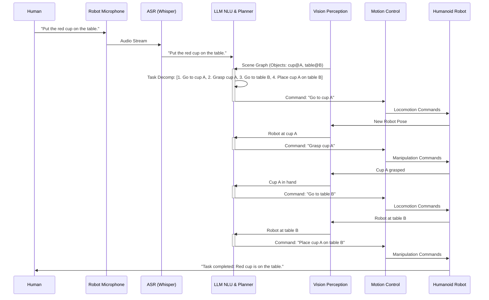

# Chapter 20: Capstone: The Autonomous Humanoid

## 20.1 Designing the End-to-End Autonomous Humanoid Pipeline

This capstone chapter synthesizes all the concepts covered in this book—ROS 2, Digital Twins, Isaac AI, and Vision-Language-Action (VLA)—into a cohesive, end-to-end pipeline for an autonomous humanoid robot. The goal is to design a system that can understand high-level natural language commands, perceive its environment, plan complex actions, and execute them physically, all while operating safely and robustly.

### The Integrated Autonomous Humanoid Architecture

```mermaid
graph TD
    Human[Human User] --> VoiceCmd[Voice Command]
    VoiceCmd --> ASR[Speech Recognition<br/>(Whisper)] --> TextCmd[Text Command]

    VisualSensors[Visual Sensors<br/>(Cameras, Depth, LiDAR)] --> Perception[Isaac ROS Perception<br/>(SLAM, Object Det)] --> EnvState[Environment State<br/>(Scene Graph, Map)]

    TextCmd --> LLM_Planner[LLM-Based Cognitive Planner<br/>(Task Decomp, Reasoning)] --> HighLevelPlan[High-Level Action Plan]
    EnvState --> LLM_Planner

    HighLevelPlan --> MotionPlanner[Motion Planning<br/>(Nav2, Inverse Kinematics)] --> LowLevelCmd[Low-Level Robot Commands]
    EnvState --> MotionPlanner

    LowLevelCmd --> RobotControl[Humanoid Control System<br/>(Whole-Body Control)] --> PhysicalAction[Physical Robot Actions]

    PhysicalAction --> VisualSensors: Feedback
    RobotControl --> DigitalTwin[Digital Twin<br/>(Isaac Sim/Gazebo)]
    DigitalTwin --> EnvState: Sim Feedback
    LLM_Planner --> DialogueMgt[Multimodal Dialogue Mgr]<--> Human

    style ASR fill:#FFE4B5
    style Perception fill:#90EE90
    style LLM_Planner fill:#87CEEB
    style MotionPlanner fill:#FFB6C1
    style RobotControl fill:#FFA07A
    style DigitalTwin fill:#ADD8E6
```

**Figure 20.1**: The complete end-to-end autonomous humanoid robot pipeline.

### Key Stages and Their Integration

1.  **Human Interface (Voice)**:
    *   **Whisper ASR**: Converts spoken commands into text (`/speech/transcribed_text`).
    *   **Multimodal Dialogue Manager**: Handles spoken interaction, clarifying ambiguities using visual context and robot state.

2.  **Perception & State Estimation**:
    *   **Visual Sensors**: Cameras, depth sensors, LiDAR provide raw data.
    *   **Isaac ROS Perception**: GPU-accelerated modules perform SLAM (`isaac_ros_argus`), object detection (`isaac_ros_detectnet`), and image processing.
    *   **Environment State**: Fuses perception outputs into a comprehensive scene graph (objects, their poses, semantic labels) and a global map (costmap).

3.  **Cognitive Planning (LLM-Based)**:
    *   **LLM-Based Planner**: Takes text commands and current environment state (from scene graph/map) to generate a high-level, decomposed action plan.
    *   **Reasoning**: Leverages LLM capabilities for commonsense reasoning, constraint handling, and task decomposition.

4.  **Motion Planning & Control**:
    *   **Nav2**: Used for high-level global path planning and local obstacle avoidance for humanoid locomotion.
    *   **Inverse Kinematics (IK) / Whole-Body Control (WBC)**: Translates planned actions into precise joint trajectories and torques, ensuring dynamic stability and balance for bipedal motion and manipulation.

5.  **Execution & Digital Twin**:
    *   **Physical Robot Actions**: The humanoid executes the commands through its actuators.
    *   **Digital Twin (Isaac Sim/Gazebo)**: A high-fidelity simulation runs in parallel, acting as a sandbox for testing, training RL policies, and providing a feedback loop for planning (e.g., simulating potential outcomes).
    *   **Sim-to-Real Transfer**: Policies and plans developed in the digital twin are transferred to the physical robot, leveraging domain randomization.

## 20.2 Capstone Project: Autonomous Humanoid for Household Chores

Let's conceptualize a capstone project: building an autonomous humanoid robot capable of performing household chores based on natural language commands.

### Goal

"The humanoid robot should be able to navigate a home environment, identify common objects (e.g., cup, book, remote), and manipulate them according to spoken instructions (e.g., 'put the red cup on the table')."

### Key Requirements

*   **Mobility**: Navigate rooms, avoid obstacles, traverse different floor types.
*   **Perception**: Recognize objects, understand their location and state.
*   **Manipulation**: Grasp and place objects reliably.
*   **Language Understanding**: Interpret diverse natural language commands.
*   **Cognitive Planning**: Decompose multi-step tasks.
*   **Robustness**: Handle variations in environment and commands.

### End-to-End Pipeline for "Put the red cup on the table"



**Figure 20.2**: Detailed sequence diagram for the "put the red cup on the table" task.

## 20.3 Testing Scenarios for Autonomous Humanoids

Rigorous testing is essential for validating the safety, robustness, and effectiveness of an autonomous humanoid robot.

### 1. Unit & Integration Testing (ROS 2 & Python)

*   **Module-level tests**: Ensure individual ROS 2 nodes (perception, planning, control) function correctly.
*   **Interface tests**: Verify communication between nodes and correct message passing.

### 2. Simulation-Based Testing (Isaac Sim/Gazebo)

*   **Regression Testing**: Run automated tests in simulation to catch regressions after code changes.
*   **Edge Case Simulation**: Test robot behavior in rare, dangerous, or unexpected scenarios (e.g., sudden obstacles, sensor failure).
*   **Performance Benchmarking**: Measure task completion time, energy consumption, and success rates in varied environments.
*   **Domain Randomization**: Use randomized environments to assess policy generalization.

### 3. Human-in-the-Loop Testing

*   **Teleoperation**: Human takes control in complex situations.
*   **Correction/Demonstration**: Human provides feedback or demonstrations to improve robot learning.
*   **User Studies**: Evaluate naturalness, usability, and safety of HRI with actual users.

### 4. Real-World Deployment & Field Testing

*   **Controlled Environments**: Initial tests in a safe, controlled physical space.
*   **Gradual Exposure**: Gradually introduce complexity and dynamic elements.
*   **Long-Term Autonomy**: Test robot performance over extended periods.
*   **Safety Protocols**: Strict adherence to safety guidelines, including emergency stops and human supervision.

## 20.4 Challenges and Future Outlook for Humanoids

### Current Challenges

*   **Hardware Robustness**: Humanoid hardware is still expensive and prone to damage.
*   **Energy Efficiency**: Long-duration operation requires significant battery capacity.
*   **Real-time Decision Making**: Integrating complex LLM/VLM planning with low-latency control.
*   **Common Sense & Generalization**: Imbuing robots with broad human-like understanding.
*   **Ethical and Societal Impact**: Addressing concerns around robot autonomy, bias, and job displacement.

### Future Outlook

*   **More Capable Hardware**: Lighter, stronger, more energy-efficient humanoids.
*   **Foundation Models for Embodied AI**: General-purpose AI models that directly control robots.
*   **Lifelong Learning**: Robots continually learning and improving from real-world interaction.
*   **Advanced Dexterity**: Humanoids performing intricate manipulation tasks.
*   **Socially Aware Robots**: Seamlessly integrating into human social structures.
*   **Human-Robot Co-Evolution**: Humans and robots learning and adapting together.

## Summary

This capstone chapter has outlined the ambitious vision for an autonomous humanoid robot, integrating all the cutting-edge technologies discussed throughout the book: ROS 2 for middleware, digital twins (Isaac Sim/Gazebo) for simulation, Isaac AI (Isaac ROS) for perception, and Vision-Language-Action (VLA) for cognitive planning and natural interaction. The end-to-end pipeline, from natural language command to physical execution, represents a grand challenge in robotics.

Key takeaways from this synthesis:

*   **Integrated architecture**: A layered approach combining specialized modules.
*   **Multimodal intelligence**: Leveraging vision, language, and motion for robust HRI.
*   **Simulation-driven development**: Using digital twins for training, testing, and sim-to-real transfer.
*   **LLMs as cognitive planners**: Enabling high-level reasoning and task decomposition.
*   **Rigorous testing**: Essential across simulation, human-in-the-loop, and real-world deployment.

While significant challenges remain, the rapid advancements in AI, robotics hardware, and simulation tools are paving the way for a future where autonomous humanoids become integral to our daily lives, assisting in homes, workplaces, and beyond. The journey outlined in this book provides a foundational understanding for those ready to contribute to this exciting frontier.

## Further Reading

*   [Google Robotics: Everyday Robots](https://blog.google/technology/ai/google-everyday-robots-project/)
*   [Figure Eight Robotics: Humanoid Robot Research](https://www.figure.ai/)
*   [Boston Dynamics: Atlas](https://www.bostondynamics.com/atlas/)
*   M. I. Jordan, "Artificial Intelligence - The Revolution Hasn't Happened Yet," *Medium*, 2018.
